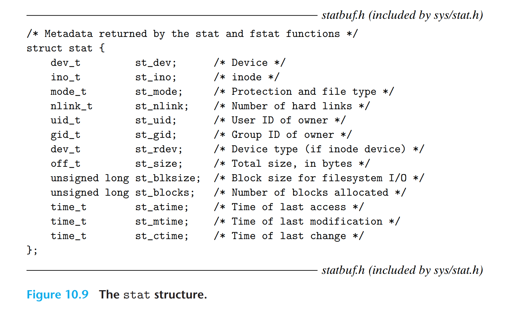

# CSAPP Learning

---
*This document is specially for Chapter 10 of book CSAPP.*

## 文件和文件操作
Unix I/O 文件读写包括以下基础操作：
* **打开**文件，返回文件标识符对应三种状态
  * stdin = 0，即从输入设备**输入**
  * stdout = 1，即要让输出设备**输出**
  * stderr = 2，**错误**
* **改变文件位置**
* **读写文件**
* **关闭文件**

*什么是文件标识符？*
当一个进程被创建时，**内核**会为它分配一个非负整数；而每一个进程都有一个**文件标识符表**，通过索引映射到更深层的文件对象。0/1/2是新进程被创建时**预先占用的id**。

比如说，我们的 `runner` 进程开始运行了，它自身就占有了0/1/2这三个标识符在**标识符表**内；
此时我们open了另一个文件 `wug.txt`，会给它分配一个标识符**3**。这个3会当close它的时候被清除。
如果我们重复open它，**依然会**给它分配新的文件标识符。

Linux文件有三种类型：
* regular file
* directory - 指针，指向文件或文件夹（孩子与父母）
* socket - 网络文件

### C语言写法
```C
int open(char *filename, int flags, mode_t mode);
```
`flags` - 权限与操作方式，用 | 链接；
`mode` - 允许访问的二进制位数
返回**文件标识符**。

```C
int close(int fd);
```
成功返回0，失败返回-1。

```C
ssize_t read(int fd, void *buf, size_t n);
// Returns: number of bytes read if OK, 0 on EOF, −1 on error
ssize_t write(int fd, const void *buf, size_t n);
// Returns: number of bytes written if OK, −1 on error
```

逐字节读写：
```C
char c;
while(read(STDIN_FILENO, &c, 1) != 0){
    write(STDOUT_FILENO, &c, 1);
}
```

### short counts 与阅读越界及优化

short counts发生在**实际读取到的字节数**少于**请求的字节数**的时候，比如遇到了网络中断，EOF等。

这可能造成阅读越界。阅读越界是**读到了逻辑上不完整的部分**，比如逐行读取，为了方便先一次性抓取了512个字节再进行处理，结果512字节包含了实际4.5行的内容，最后一行内容不完整逻辑断裂。

它们不会明显地引发错误，会由于**大块读取**，**读取命令行**，**读写网络文件**等条件触发。但是**为了程序的Robust**，我们有必要去处理优化这个越界行为，因为当发生了short counts之后不经过检查，继续阅读文件，就可能会出现**逻辑断层**等问题。

针对这个优化，csapp给出了一个rio方案。
* **无缓冲**的 `rio_readn` `rio_writen`，检测到short counts的情况下会继续**整体地索要**剩下的未读到的数据字节，直到EOF等强制结束因素或字节读完为止。但是缺点是**多次发起请求效率低下**。

* **有缓冲**的 `rio_readinitb`, `rio_readlineb`, `rio_readnb`
定义了结构体
```C
#define RIO_BUFSIZE 8192
typedef struct {
    int rio_fd; /* Descriptor for this internal buf*/
    int rio_cnt; /* Unread bytes in internal buf */
    char *rio_bufptr; /* Next unread byte in internal buf */
    char rio_buf[RIO_BUFSIZE]; /* Internal buffer */
} rio_t;
```
一次抓完**大量的**，然后再仔细处理，最后一行多出的部分存在 `rio_buf` 里面。

这两种方法混用可能会导致**冲突打架**，因为有缓冲的是把数据存在结构体里。

## 读取文件Metadata


通过 `stat` 与 `fstat` 函数返回的 `stat` ，**描述了文件的一些属性**。
`stat` 使用filename作为输入，而 `fstat` 使用文件描述符。

## 读取文件夹

```C
DIR *opendir(const char *name); //Returns: pointer to handle if OK, NULL on error

struct dirent *readdir(DIR *dirp); //Returns: pointer to next directory entry if OK, NULL if no more entries or error
struct dirent {
    ino_t d_ino; /* inode number */
    char d_name[256]; /* Filename */
};

int closedir(DIR *dirp); //Returns: 0 on success, −1 on error
```

## 共享文件
Linux对每个打开的**文件**在**内核**中维护了：
* **Descriptor table** - 每个进程都有一个，文件标识符为索引，指针指向flie table
* **File table** - 被所有的进程共享，包括
  * 当前的**文件位置**
  * **reference count**: 被多少个进程共享
  * 一个指向v-node table的指针
* **v-node table** - 基本包含着文件属性的内容，被所有进程共享

从而我们可以理解，`fork()` 时子进程相当于**复制了**父进程的descriptor table。

## I/O重定向
```C
int dup2(int oldfd, int newfd); //Returns: nonnegative descriptor if OK, −1 on error
```
更改文件描述符，会**覆盖原位置上的文件，强行关闭它**。

## 标准I/O流以及操作函数的使用

*The C language defines a set of **higher-level input and output functions**, called the
standard I/O library, that provides programmers with a higher-level alternative
to Unix I/O.*

`FILE` 类型的文件流是对一个文件**文件描述符**和**流缓冲区**的集成抽象，这个buffer缓冲区的工作原理类似于rio。

### 使用建议
* 尽可能使用**标准输入/输出流**。
* 不要用 `scanf` or `rio_readlineb` 读取二进制文件，它们实现上专门用来读**文本文档**。
* 读写操作网络文档使用 `rio`，标准I/O流可能会出问题。

原因是**它在对同一个流同时读同时写的兼容性上比较差**。
*限制 1（写完想读）： 如果你刚执行完“输出（写）”，接下来想“输入（读）”，中间必须穿插调用 fflush（清空缓冲区）、fseek、fsetpos 或 rewind（重置文件指针位置）这几个函数之一。*
*限制 2（读完想写）： 如果你刚执行完“输入（读）”，接下来想“输出（写）”，中间必须穿插调用 fseek、fsetpos 或 rewind（除非你读到了 EOF）。*
而在网络文档中，`fseek` **倒带移动**文件指针是**不可行**的。

```C
FILE *fpin, *fpout;
fpin = fdopen(sockfd, "r");
fpout = fdopen(sockfd, "w");

fclose(fpin);
fclose(fpout);
```
这个方法**不可行**的原因：这个文档的 `reference count` 因只有一个进程所以**值为1**，关2次可能会出问题，在**并发编程**的环境下可能引发更大的问题。

只close一次会导致**内存泄漏**，与某个文件直接相关的内存（比如 `FILE` 类的存储）无法被释放。

## 案例回顾：scanf() 与 printf()
它们就是用了 `stdin`（文件标识符0） 和 `stdout`（文件标识符1）这两个东西。

---

***By Tab_1bit0***