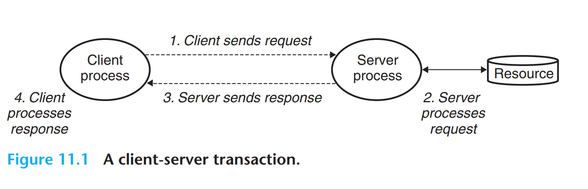
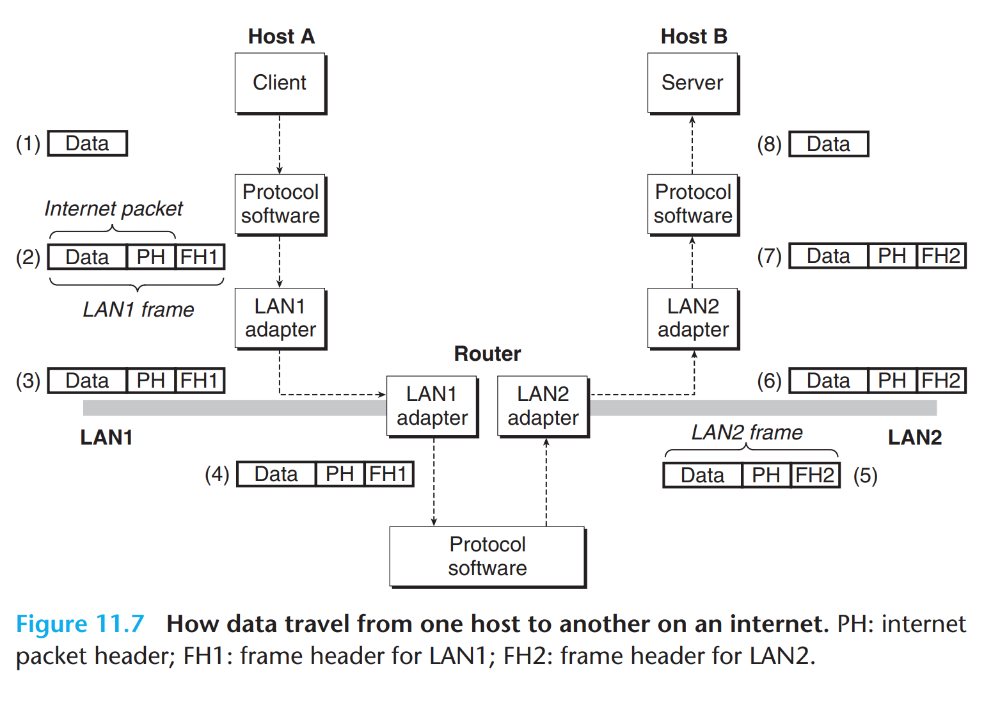
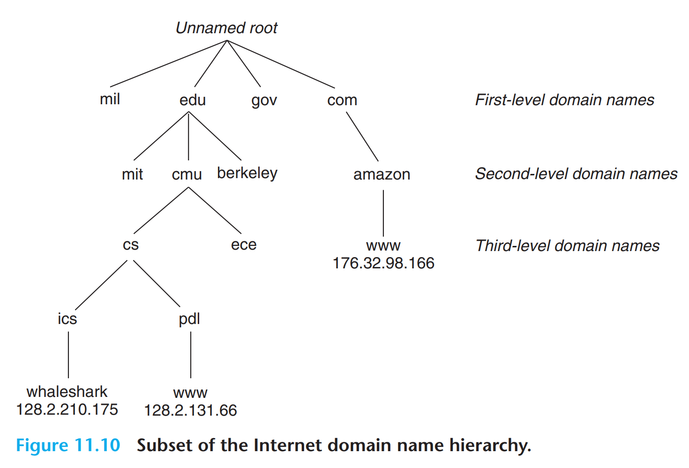
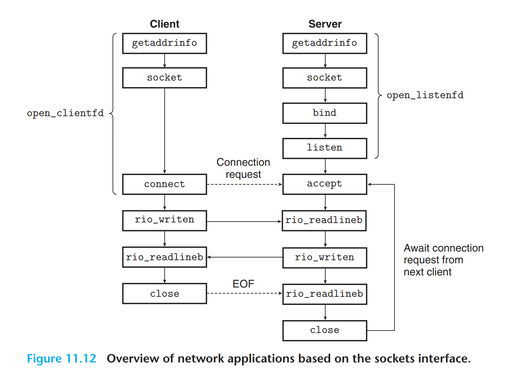
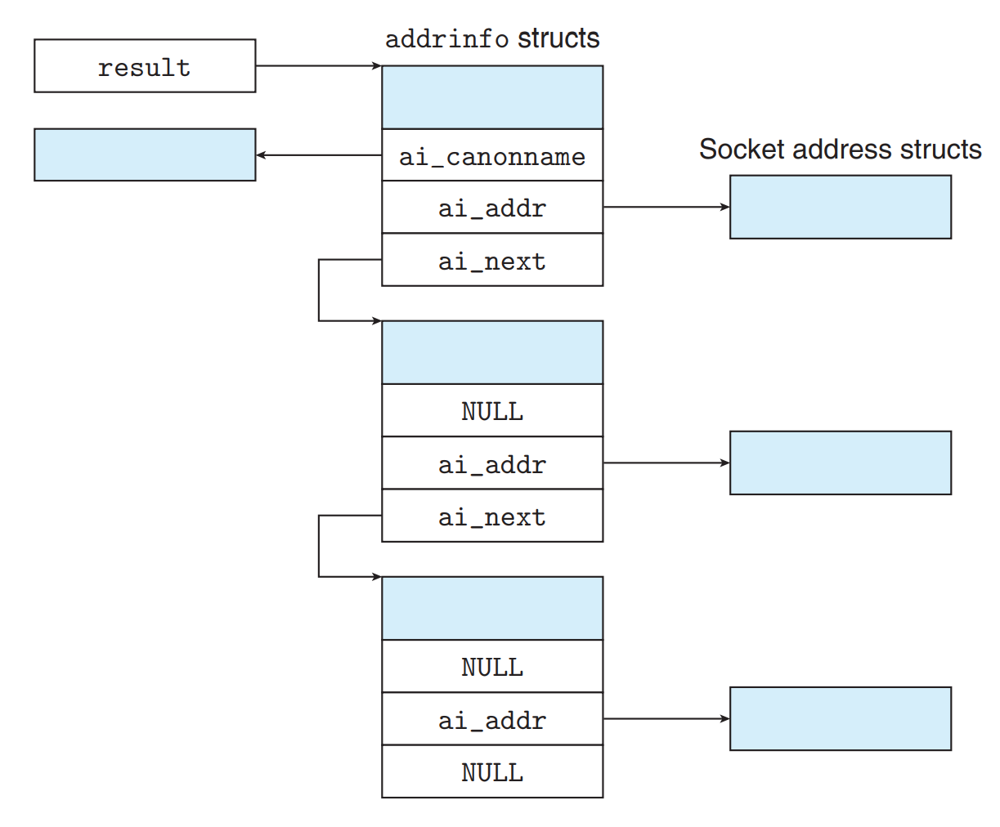
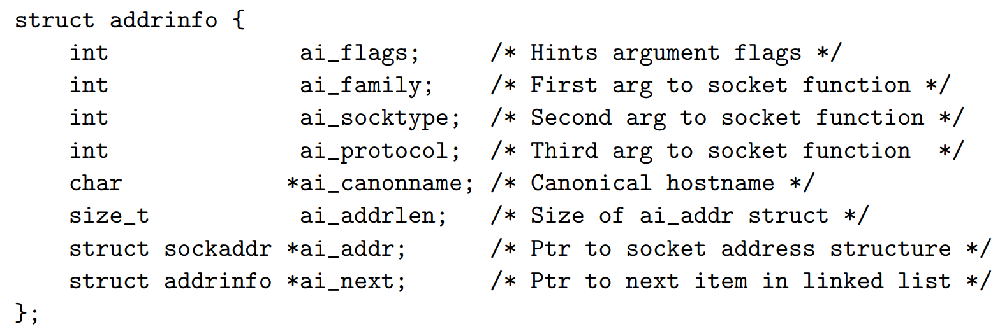

# CSAPP Learning

---
*This document is specially for Chapter 11 of book CSAPP.*

## client 和 server


关注两对概念与工作流程：
* client & server
* request & response

## 网络数据的传输


最重要的是体现了**封装**的思想。

但是依然有很多的**细节问题**没能解决：

### The Global IP Internet: 统一性
它使用**TCP/IP协议**，其中包含解决数据丢失问题的UDP等。

#### IP Address IP地址
相当于**住址信息**，要上哪里去找人。
在网络上传输的字节数据都**使用大端法存储**，尽管主机中是小端法。

#### Internet Domain Names 域名

本地部署的是 `127.0.0.1` (localhost)。

**DNS** (Domain Name System) 指的是域名到IP的映射。

#### Internet Connections 网络连接
使用Socket（套接字）来保证信息传输准确性。
Socket Address包括 **ip地址 + 16位整数端口号 (port)**。
有一些约定俗成的常用端口号，比如email服务用25，Web服务器用80。

## Socket Interface 套接字接口


### 相关方法实现
```C
int socket(int domain, int type, int protocol);

int connect(int clientfd, const struct sockaddr *addr, socklen_t addrlen);

int bind(int sockfd, const struct sockaddr *addr, socklen_t addrlen);

int listen(int sockfd, int backlog);

int accept(int listenfd, struct sockaddr *addr, int *addrlen);
```

```C
int getaddrinfo(const char *host, const char *service,
const struct addrinfo *hints,
struct addrinfo **result);

void freeaddrinfo(struct addrinfo *result);

const char *gai_strerror(int errcode);
```
工作原理：
* **转换** - 将主机名称 `host` 和 端口 `service` 自动安全地转换成复杂的网络通信需要的**二进制结构体**。
* **获取** - 访问DNS服务器，获取对应的IP等信息
* **个性化** - 将获取的信息可以通过 `hints` 设置**喜好**，以特定形式提供给用户

`freeaddrinfo` 的功能是释放 `getaddrinfo` 的内存，防止内存泄漏。



* `ai_flags` 可以通过**掩码位运算**得到对应的hints内容；
* `ai_family` `ai_socktype` `ai_protocol` 都可以**直接作为参数传给** * `socket`；
`ai_addrlen` 和 `ai_addr` 又分别可以传给 `bind` 和 `connect`。

此外这里我们把 `result` 传参传入，函数**直接修改** `result` 对应的内容。

*为什么result要设计成**双重指针**？*
- 因为一个域名可以有**很多个**不同的ip地址对应。

```C
int getnameinfo(const struct sockaddr *sa, socklen_t salen,
char *host, size_t hostlen,
char *service, size_t servlen, int flags);
```

这个是上述的**逆操作**，如果不想要\*host，把\*host设成NULL，hostlen参数置0即可。
`flag` 也是位掩码，设置**返回格式**，比如service name还是port。

***service name 与 port 有什么区别和联系？***
- service name是对一些特殊状态端口号的**别名区分**，比如 `80` 对应 `http`。

此外，csapp给了两个扩展方法：
```C
int open_clientfd(char *hostname, char *port);
int open_listenfd(char *port);
```
这两个方法封装了**整个建立连接过程**，直接返回对应文件的文件标识符。

## Web Servers
Web是用户应用层面的存在，区分于FTP的**文件检索**特征，它使用**HTTP协议**，用**HTML语言**书写。

### Web content
Web服务器中的文件资源，通过**两种方式**提供：
* 提供**静态内容**，比如 *https://tab-ibito.github.io/learning/bomblab*
* 运行可执行文件返回结果，即**动态内容**。

所有文件都通过URL定位。可执行文件的启动项参数通过 `/?id=1&name=Tabibito` 的后置项输入。
有三个**特征**：
* 静态和动态不显著区分
* URL的第一个斜杠不是真实服务器机器本地目录，只是虚拟的
* 类似于我们输入 *https://www.bilibili.com* 的情况，浏览器自动会补全**斜杠+index.html**

### HTTP Request & Response

建立链接后，通过Request和Response的特定对话方式**获取内容**。

#### HTTP Request的格式：
* 第一行：**Request Line 请求行** 方法(Method) URI 版本(Version)
  * `GET / HTTP / 1.1`
* 第二行：**Request Header 请求报头** 名字: 内容
  * `Host: www.aol.com`
* 第三行：结束 `\r\n`

这是我们所说的 **`GET` 方法**。

#### HTTP Response的格式：
* 第一行：**Response Line 响应行** 版本(Version) 状态码(Status-code) 状态信息(Status-message)
  * `HTTP/1.0 200 OK`
* 第二行：**Response Headers 响应头** 关于content的信息
  * `Content-Type: text/html`
  * `Content-Length: 42092`
* 第三行：空行 `\r\n`
* 后面是**响应体** (Response Body)，即HTML代码或MIME文件内容

### Serving Dynamic Content

Request方面，通过 `/?id=1&name=Tabibito` 的后置项**输入传参**（CGI-Environment）。

服务器接受之后会 `fork` 并 `execve` 对应地址内容的**子进程**，传入参数开始工作。

子进程把输出结果给到 `stdout`，但是它重定向到**对应socket的文件描述符**去，即 `dup2(connfd, STDOUT_FILENO)`，这个过程发生在执行 `execve()` 前。
此外，子进程有**完成HTTP Response**的责任。

---

***By Tab_1bit0***