# CSAPP Learning

---
*This document is specially for Chapter 12 of book CSAPP.*

## Concurrent Programming 的三种实现

### Concurrent Programming with Processes

特点：对于每一个client，server都会 `fork()` 一个新的子进程**对应处理**。

优点：每个子进程都有**各自独立的虚拟内存**，运行**独立而安全**。

缺点：
* **子进程无法直接共享信息**，只能借助IPC (interprocess communications) 进行，
* 此外IPC和运行切换上下文**时间成本高**。

### Concurrent Programming with I/O multiplexing

特点：基于**I/O多路复用**。

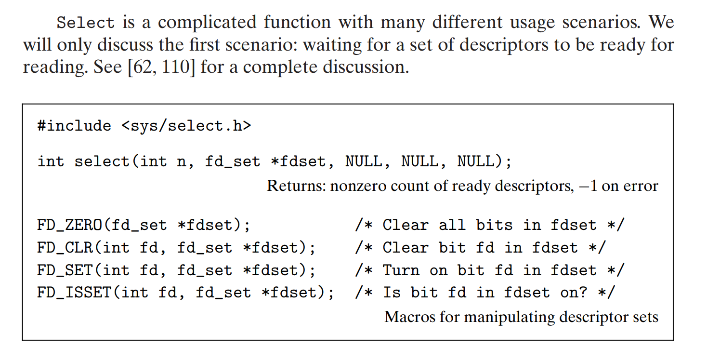

即我们人为的编辑了一张 `fdset`，并通过 `select` 告诉系统**挂起**原进程，**监听**这个集合里面的对应文件的读写操作，`select` 监听到后，也会**重置** `fdset`，告诉用户**哪个文件**的读写被监听到。

`fdset` 实质上是一个**n位二进制数**，低往高第k位代表**是否**监听了**文件描述符为k的**文件。

我们用 `FD_ZERO` 等这四个宏来**操作**这张 `fdset` 。

*网络文件的读写操作直接**点对点**进行，不需要对stdin/stdout重定向。*

#### 案例

CSAPP书中用结构体 `pool` 维护了这么一个事情

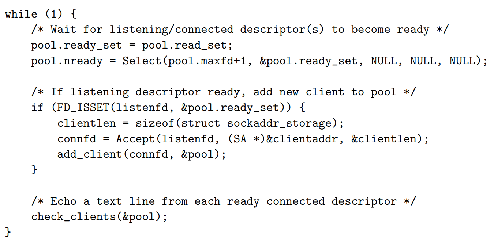

在一个大的 `while(1)` 里面:
* 一开始 `pool` 的 `read_set` 里面只有listenfd和stdin
* 然后 `ready_set` 和 `read_set` 同步， `select` **挂起** `ready_list`
* 如果是listen_fd被监听到了，那么就 `accept()` **建立链接**，并把它加到池子里

我们通过 `pool` 真正的实现了多个文件同时打开的**高并发模式**。

#### 优缺点

优点：
* 对 `ready_set` 的管控程度高，可以决定对fd的**优先级**逻辑
* 运行在同一进程中，可以**共享数据**
* **Debug**更加容易
* 没有上下文开销，**性能高**

缺点：
* 代码**复杂度**高
* 本质是单进程，容易被**卡死** *(vulnerable to a malicious client that sends only a partial text line and then halts)*
* **无法利用多核**CPU

### Concurrent Programming with Threads

一个进程中产生**若干线程**，每个线程都有**独立的context**，包括*线程 ID (TID)、程序计数器 (PC)、寄存器集合，以及**独立的程序栈** (Stack)*。

但是，一个进程中所有线程**共享相同的虚拟地址**。

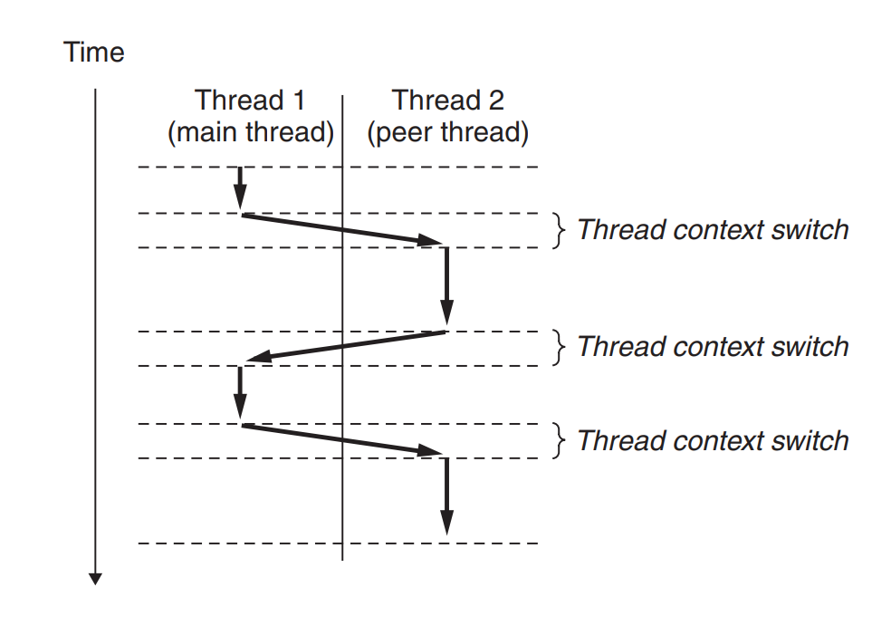

这里会发生context switch，但是相比**进程**而言更快。它会由于慢的 `sleep()` 或 `read` 等系统函数触发，也会因为**系统内部定时器**触发。

#### C语言线程实现：pthread
```C
void *thread(void *vargp) /* Thread routine */
{
    printf("Hello, world!\n");
    return NULL;
}
```
人工声明某个线程内部**做什么事情**，传到下面`func *`f的地方。

```C
int pthread_create(pthread_t *tid, pthread_attr_t *attr, func *f, void *arg);

pthread_t pthread_self(void);

void pthread_exit(void *thread_return);

int pthread_cancel(pthread_t tid);

int pthread_join(pthread_t tid, void **thread_return);

int pthread_detach(pthread_t tid);
```
通过 `pthread_create` 创建一个线程。
`pthread_self` 返回当前线程tid值。
`pthread_exit` **显式终止**线程，如果**进程的主线程调用**，那么会先等同伴线程都终止，在终止主线程和进程。
`pthread_cancel` 传入tid，**终止**该线程。
*如果某个线程调用exit()函数终止，那么会把**所有线程和进程**一并终止掉。*
`pthread_join` **等待**特定线程终止。
`pthread_detach` 使得线程从默认的joinable变成detached，这意味着它**不能被其他线程监控或终止**，也意味着它的内存区域清理发生在**终止后系统自动清理**。

注意到*thread_return*指针是为了**回收相应joinable线程的内存空间**，防止内存泄漏。

```C
#include <pthread.h>
pthread_once_t once_control = PTHREAD_ONCE_INIT;
int pthread_once(pthread_once_t *once_control, void (*init_routine)(void));
```

初始化，定义一些全局变量时用。

##### 案例
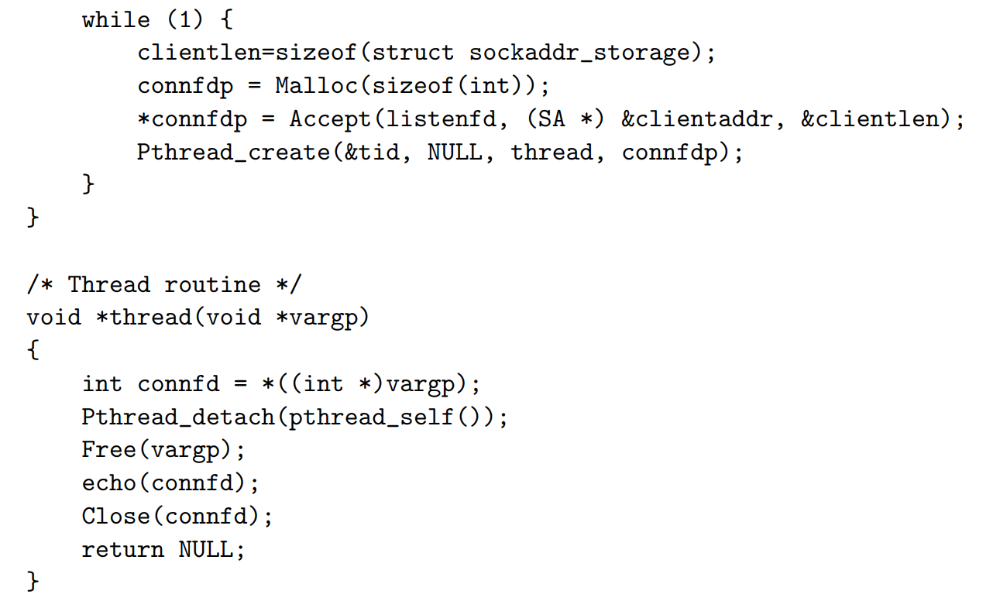


#### Shared Variables
有三种类型
* **全局变量**
* **局部静态变量**
* **局部自动变量**

前两者存在数据读写区里面，而**局部自动变量**存在**独立的程序栈中**。

但是我们要注意， local automatic variables such as msgs **can also be shared**.

做法：通过**跨栈指针**，把某个变量地址贴到全局变量，然后直接**对地址操作读写**。

## Synchronizing Threads with Semaphores

```C
void *thread(void *vargp)
{
    long i, niters = *((long *)vargp);

    for (i = 0; i < niters; i++)
        cnt++;

    return NULL;
}
```

我们同时运行两个这个线程，最后会发现 **cnt的值不等于2*niters**，并且每次运行**结果都不相同**。

### 为什么？

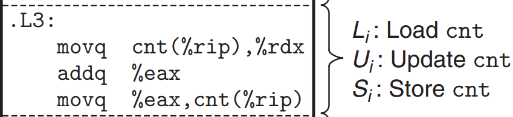

`cnt(%rip)` 是特殊**相对寻址**方式，因为 `cnt` 是全局变量。

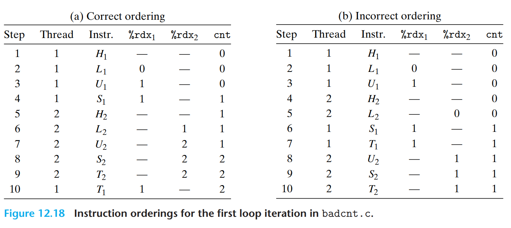

因为这里线程工作顺序可能会乱套。汇编的角度而言，`cnt++` 的过程包括了Load, Update, Save**三步**的过程。如果两个 `cnt++` 的时序错乱了，就会出现存值的错位情况。

*为什么有两个%rdx?*

* 因为寄存器值虽然确实在CPU中计算的，但它们也同样**存在线程的context里面**，**不同线程之间的寄存器不共用**。

### Process Graphs 进程图
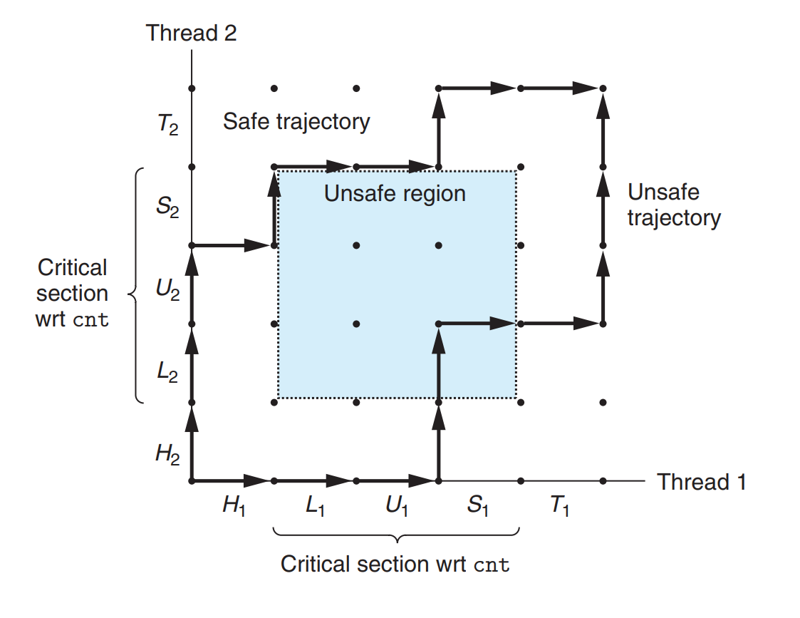

根据两个进程的执行走向transition顺序，我们可以画出进程图 **trajectory**（轨迹）
在上面案例中，我们的 Load -- Update -- Save 是**关键步骤**，绝对不可以互相打断，即在 Unsafe Region 中执行会导致出错。

我们必须要 **synchronize**（同步），a classic approach is based on the idea of a **semaphore**（信号量），实现 **Mutual Exclusion**（互斥）的机制。

* 缺陷：进程图是**单核下的产物**，多核运作会失效，但是上锁的核心思想一致。

### Semaphores 信号量

Edsger Dijkstra发明。

* `P(s)`
  * 如果 s 非零，那么P将s**递减1**后马上返回。
  * 如果 s = 0，**那么挂起该线程**，直到被 `V(s)` 重新将s置非0；
* `V(s)`
  * 将s**递增1**，如果有多个被挂起的线程为0，那么**只会唤醒其中一个**，并将s置1。

在C语言中通过以下方法维护：
```C
#include <semaphore.h>
int sem_init(sem_t *sem, 0, unsigned int value);
int sem_wait(sem_t *s); /* P(s) */
int sem_post(sem_t *s); /* V(s) */
```
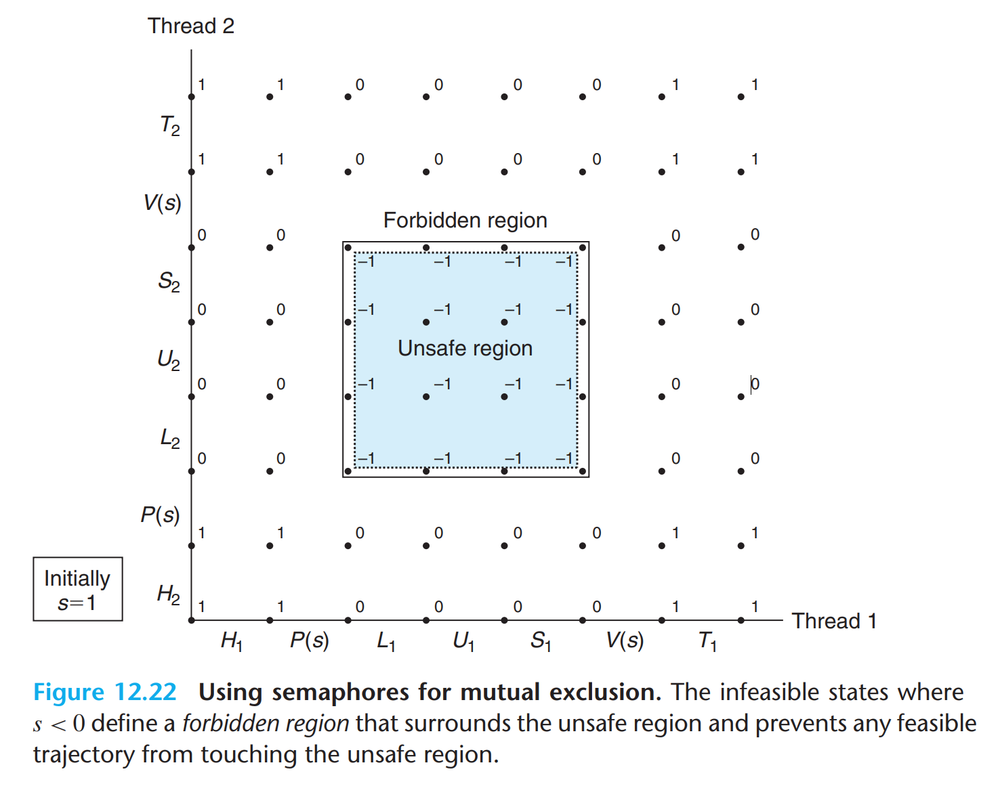

这个s相当于是一个开启进入 Critical Session 的**钥匙锁**，一人一用。
我们**把核心代码改成**：
```C
P(&mutex);
cnt++;
V(&mutex);
```

*为什么P和V操作**可以保证是原子性**的？*

因为经过了操作系统和硬件的**特殊封装**，提供给它们特用的**自旋锁**。

### Producer-Consumer Problem

*The producer **generates** items and **inserts** them into a bounded buffer. The consumer **removes** items from the buffer and then **consumes** them.*

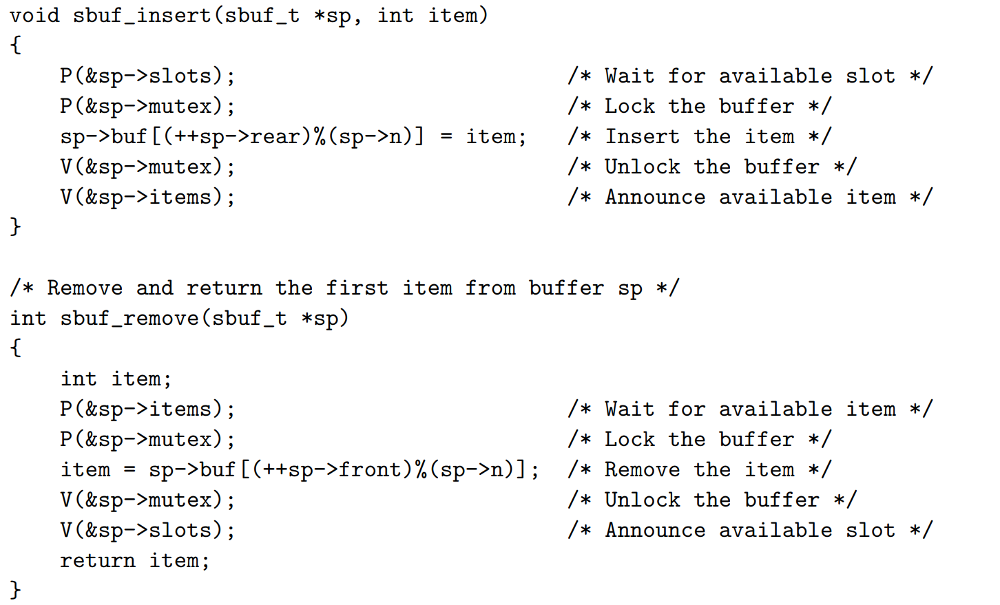

注意这个过程中对buf区域的**保护**。

### Readers-Writers Problem
这是互斥问题的**泛化**形态称呼。特点是**读可共享，写需独占**。

两类做法：

* 第一类：利好Readers。只有当**没有任何Reader在读数据**，Writer才有权限工作。换言之，拿缓冲区钥匙**权限等级** **Readers > Writers**
* 第二类：利好Writers。Writer**只需要待在序列中的Readers读完**，就可以上去工作，而不管排队时后面来的Readers。

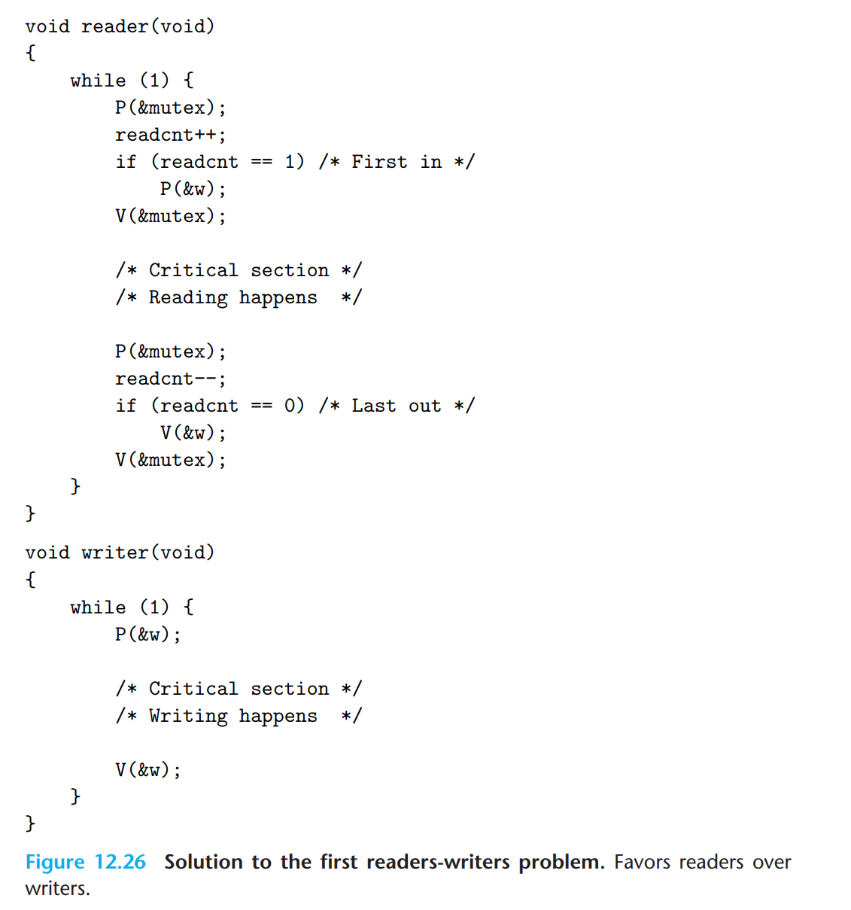

注意 `readcnt == 0` 的条件。

我们也可以通过这个模型实现类似**I/O多路复用**中的**Event Driven**机制。

## 线程与并行编程

实际的CPU是**多核并行**，而并行（Parallel）是并发（Concurrent）的subset，要针对**并行**进行优化。

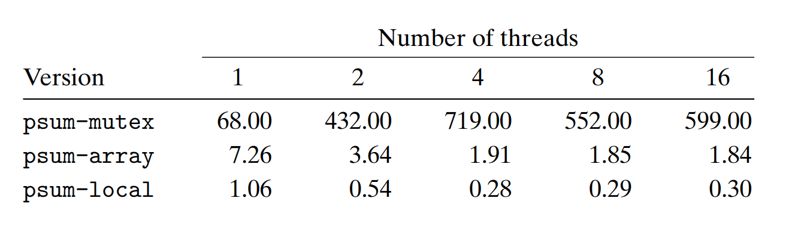

针对
* **唯一全局变量上锁**
* **全局数组，每一个元素放给一个进程修改**
* **使用局部寄存器，最后一次才加给全局变量**

这三种方法来运行 `psum` 的求和运算任务，我们发现**上锁解锁，访问主存的时间成本很高**，并且**过度上锁拖累效率**。

我们用**Speedup**（加速比）以及**Efficiency**（并行效率）衡量增加线程数带来的改变。

**$$S_p = \frac{T_1}{T_p}$$**
**$$E_p = \frac{T_1}{p*T_p}$$**

**弱扩展与强扩展**（Weak/Strong Scaling）是两个重要的**性能考核**指标。  
* 前者控制线程数和处理量都增加；
* 后者只控制线程数增加，处理量保持不变。
* 一般弱扩展反应更真实，更有参考价值。

## 其他并发问题

### 线程安全性

有四类**不安全的**线程操作：
* 不保护**共享变量**
* 函数被**多重调用**，比如 `rand` 伪随机种子生成
  * **解决方法**：**重写**函数
* 函数返回**指向static变量**的指针
  * **解决方法**：
  * **重写函数**，参数项让caller提供指向**储存结果**的指针，**消灭共享变量**
  * 如果没法修改这个函数：**先上锁再调用函数复制结果后解锁** (lock-and-copy)
* **call了线程不安全**的函数
  * **解决方法**：同样是lock-and-copy

### Reentracy 可重入性

一种特殊的**线程安全的**函数，它**消灭了所有共享变量**，改用**各自独立的程序栈存储**

* **显式**可重入：函数**不调用任何全局变量**
* **隐式**可重入：参数项让caller自行提供指向**储存结果**的指针，*需要保证传入的指针指向的是**非共享**数据*

### 使用已有库中函数
*Most Linux functions, including the functions defined in the standard C library (such as malloc, free, realloc, printf, and scanf), **are thread-safe, with only a few exceptions**.*

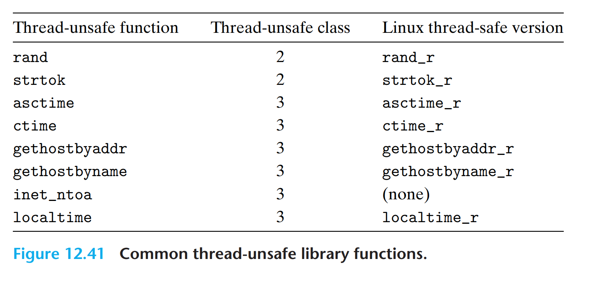

#### Race 竞态条件

```C
int main()
{
    pthread_t tid[N];
    int i;

    for (i = 0; i < N; i++)
        Pthread_create(&tid[i], NULL, thread, &i);
    for (i = 0; i < N; i++)
        Pthread_join(tid[i], NULL);
    exit(0);
}

/* Thread routine */
void *thread(void *vargp)
{
    int myid = *((int *)vargp);
    printf("Hello from thread %d\n", myid);
    return NULL;
}
```

发生了什么？
`Pthread_create` 的时候， `&i` 把 i 变量的地址交给了新创建的进程，这意味着新进程有**直接读写i原值的权限**。

如果新线程的 `int myid = *((int *)vargp);` 执行的比 `i++` 更慢，就意味着i的值不会式预期所示的。这叫做Race。

解决方法：
```C
ptr = Malloc(sizeof(int));
*ptr = i;
Pthread_create(&tid[i], NULL, thread, ptr);
/*In function main*/

Free(vargp); 
/*In Thread*/
```
注意这里**异步性**的问题，我们的 `malloc()` 要由**创建的线程**回收。

#### Deadlock 死锁
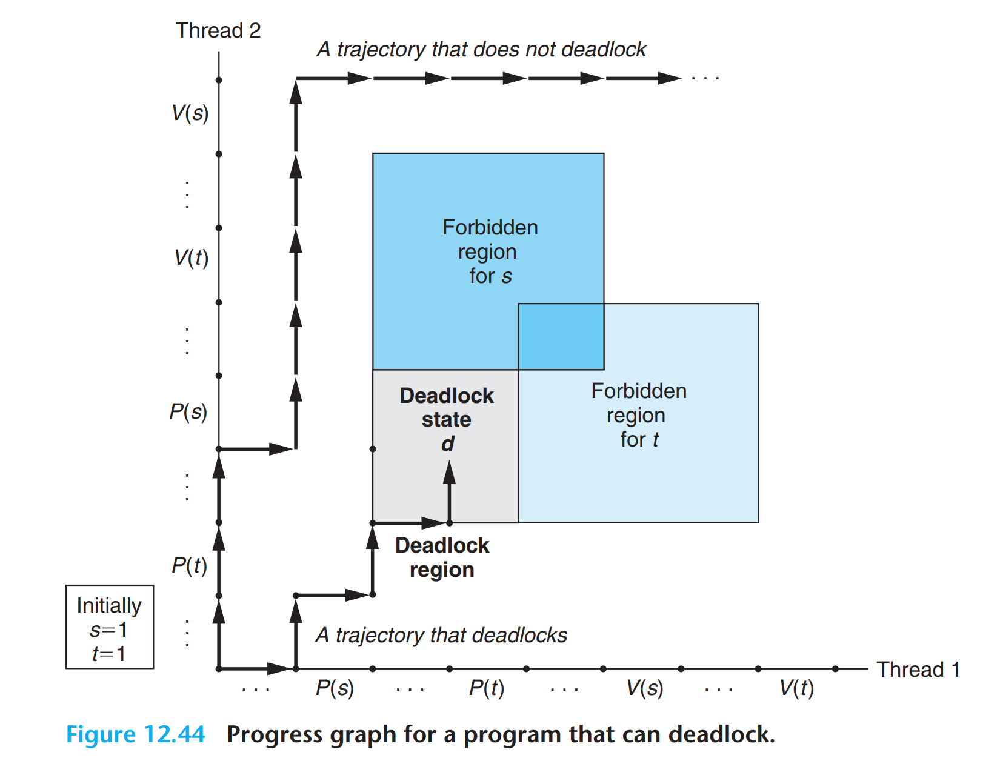

途中的 Deadlock State **进入后s和t都被上锁了**，换言之**怎么动都动不了**。

这类问题很难预测，也很难解决。可以通过一个简单的工作来**预防**：
Mutex Lock Ordering Rule - **acquires its mutexes in order and releases them in reverse order.**
即保证所有的**包含嵌套关系**成立。

---

***By Tab_1bit0***