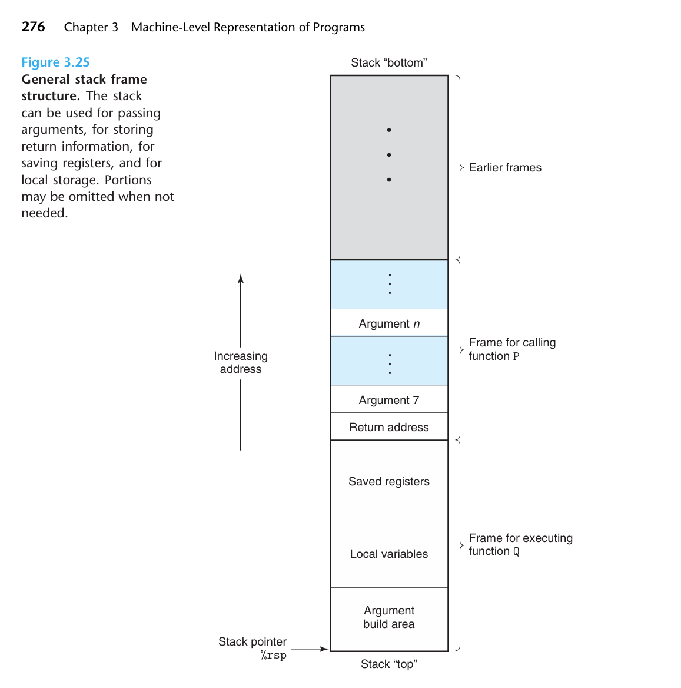

# CSAPP Learning  
---

## **寄存器与寻址**
寄存器只有16个，所以汇编的时候会**优化**，让最需要的放在寄存位置，其他的先放在后台

类比于**C语言的指针** \*p  

$$Imm(rb,ri,s) = M[Imm+R[rb]+R[ri].s]$$
```C
struct Idol {
    int id;       // 占4字节 (偏移量 0)
    int height;   // 占4字节 (偏移量 4)
    int score;    // 占4字节 (偏移量 8)
};
struct Idol niji_club[12]; // 虹咲学园偶像同好会的12位成员数组喵！
```
对于 `niji_club[i].score` 有  

$$\text{Address} = 8 + r_b + {i \times 12} \cdot 1$$
* Imm - Immediate 立即数，全局情况下是数组绝对起始位置（取代掉rb），局部则是距离（栈帧顶部指针）偏差值，**固定**
* rb - 基址，整个数组在内存的绝对起始位置，**动态**
* ri - 动态的访问数组的**下标**
* s - 适配数组数据类型大小，1/2/4/8取值（**对应到数据类型的Byte**）

对于结构体的特殊情况会如上处理，一个Idol的大小是12Byte（超出限制），那么机器会 **将s设为1**，而将ri设为 **12\*i**，动态调整

可以直接使用`leaq`指令，将目标的**内存地址**直接写入目标寄存器  
在64位的机器中内存地址是64位的，所以没有除了q外其他变种  
*（哈Gemi说可能会用leal做int32的运算）*

## **mov 指令**
赋值，at&t 环境下是 **左 -> 右** 的逻辑。  

memory to memory is **forbidden**.  
**Substitution:**   
```
mov memory, register
mov register, memory
```
### 特殊情形：
* **movq 动立即数**
* * 取32位的two's complement，**符号扩展到64位**  
  * 64位的immediate使用`movabsq`
* **不同大小**零扩展 - ZeroExtend & 符号扩展 - SignExtend  

以及Change Destination Register有关一个特殊规定：
```Bash
1 movabsq $0x0011223344556677, %rax %rax=0011223344556677
2 movb $-1, %al %rax=00112233445566FF
3 movw $-1, %ax %rax=001122334455FFFF
4 movl $-1,%eax %rax=00000000FFFFFFFF # 32位赋值后高位都被置为0
5 movq $-1,%rax %rax=FFFFFFFFFFFFFFFF 
```
*32位机器上跑int64？拆两半*

## **算术运算的优化**

### leaq的加法乘法优化

**From**
```C
long scale(long x, long y, long z) {
    longt=x+4*y+12*z;
    return t;
}
```
**To**
```Bash
x in %rdi, y in %rsi, z in %rdx
scale:
leaq (%rdi,%rsi,4), %rax # x + 4*y
leaq (%rdx,%rdx,2), %rdx # z + 2*z = 3*z
leaq (%rax,%rdx,4), %rax # (x+4*y) + 4*(3*z) = x + 4*y + 12*z
ret
```
leaq 方法的优化性：
* 三元运算，一个时钟周期内一起做乘法和加法
* 不需要去内存找值，速度快
* 无覆盖性和破坏性
* 绕开Condition Code Register的状态改变

### 结合位运算优化
左移/右移快速对应乘除法

## **条件，跳转，控制**

### 关于条件码
Condition Code Register 被动态地维护，里面存着各种各样的conditions（溢出/相等/……），每一个Condition Code 都占1bit(0/1)。

各种算术操作都可能改变里面的条件值。
* CF - Carry Flag 位数变多置1
* ZF - Zero Flag 为0置1
* SF - Sign Flag 负数置1
* OF - Overflow Flag 溢出置1

不给寄存器赋值只修改条件码——**cmp系列**（按减法结果），**test系列**（按位与结果）

set系列可以把条件码的值（按一定规律）读出来赋值  
搭配食用：  
```Bash
cmpq %rsi, %rdi
sete %al # e --> equal
```
**组合拳有**：`setl`*(where l represents "less")* 得到的是 ``OF ^ SF``的结果，要考虑溢出（参见Datalab的Solution）

### 跳转，分支，循环
`jmp`是无条件跳转，`j`系列是条件跳转，配合实现循环。

jmp的跳转 (branch) 指令**在现代处理器**下效率不如条件赋值 (conditional move) 效率高，原因是分支预测器可能在if语句长的情况下猜错了路导致时间浪费的情况。

**但是**：conditional move也会导致计算浪费，无法规避可能报错等情况，实际上跳转的形式会被编译器采用的更多。

jmp标记实际执行的时候不会被保留，反汇编会给出另一种方便核实的方法：  
通过`jmp 8<loop+0x8>` 直接锁定它在指令中的字节位置。

条件赋值使用`cmov`系列完成，例如`cmovge`相当于基于大于等于的判断。

.L2/.L3都只是一个**路标的标记作用**，没有实际的代码分块含义，类似五线谱的D.S.记号（从某处开始继续执行）。

*rep repz 的写法比较特殊喵*

### Switch语句的跳转表（Jump Table）设计
```C
voidswitch_eg(longx,longn,
long*dest)
{
    longval=x;
    switch(n){
        case 100:
            val *= 13;
            break;
        case 102:
            val += 10;
            /*Fallthrough*/
        case 103:
            val += 11;
            break;
        case 104:
        case 106:
            val *= val;
            break;
        default:
            val=0;
    }
*dest = val;
}
```
```
1 switch_eg:
2 subq $100,%rsi Computeindex=n-100
3 cmpq $6,%rsi Compareindex:6
4 ja .L8 If>,gotoloc_def
5 jmp *.L4(,%rsi,8) Goto*jg[index]
6 .L3: loc_A:
7 leaq (%rdi,%rdi,2), %rax 3*x
8 leaq (%rdi,%rax,4), %rdi val=13*x
9 jmp .L2 Gotodone
10 .L5: loc_B:
11 addq $10,%rdi x = x + 10
12 .L6: loc_C:
13 addq $11,%rdi val = x + 11
14 jmp .L2 Gotodone
15 .L7: loc_D:
16 imulq %rdi,%rdi val = x * x
17 jmp .L2 Gotodone
18 .L8: loc_def:
19 movl $0,%edi val = 0
20 .L2: done:
21 movq %rdi,(%rdx) *dest=val
22 ret Return
```
`jmp *.L4(,%rsi,8)` 访问了.L4地方所存的跳转表，这个是$O(1)$的复杂度访问

*这里rb = 0仅是出于教材的案例选取考虑*

我们有：
```
.section .rodata
.align8 Alignaddresstomultipleof8
.L4:
.quad .L3
.quad .L8
.quad .L5
.quad .L6
.quad .L7
.quad .L8
.quad .L7
```
关于.字开头的「伪指令」：
* 它的作用是给汇编器看的舞台布置脚本，主要作用是声明。
* 不实际参与CPU执行。
* 这里的.quad就是开辟了一片空间，可供访问。

也就是说：
* 我们在这里直接定义了一个数组，而且是**static & const** 的
* **内存地址**这是一个很宽泛的概念，程序指令和变量都有
* default情况下的.L8被填入了空缺位置，保证数组下标连续性，也符合实际的运行逻辑。
* 从case 100这类复杂情况到最后0/1/2这里的内存寻址，实际经历了**编译器**的**自动优化**。
  * n-100，>6的时候跳入default。
  * <=6 的时候有对应case就进对应case，没有就跳入default。
* 数组声明长度是8而不是其他更小的数，也是出于其**长度规整性**的考量。 
* `ja` means above **unsignedly**. 它避免了比如n=99时候的报错。

这样，我们直接通过基于switch(n)的n值完成了对应语句块的跳转，

***从而在处理多分支情况时，使switch的逻辑相比if-else运行更快，但也意味着空间的更多使用。***

## **Procedure与栈帧艺术**
  
Frame for executing function Q 的内存预留，在被调用函数Q的地方已经被写好：  
`subq $16,%rsp`把这一部分空间全都给预留出来了。  

### Run Time Stack 运行时栈

整个程序的所有栈帧都建立在这个大栈上面，地址连续，它不断地扩张着向着低地址生长。  
#### **Frame for calling function P**
在函数P执行call Q之前，它会先把Argument n ~ Argument 7，`%rip`按顺序压入栈中，这个时候的`%rsp`处理完正指着Return address的栈顶，但是是栈内元素增长，没有挪动过`%rsp`。

#### **Frame for executing function Q**
* Saved registers - 这里是给各种callee saved暂存寄存器的值所用的
* Local variables - 这里是给各种寄存器里放不下的变量储存用的
* Argument build area - 这里是为后续可能有的函数传参做预留空间

#### **寄存器去哪了？**
它本体在cpu里面，**根本不是这个栈帧的一部分**。

### 加深一下寄存器的知识喵
* %rsp - 是一个可以执行函数跳跃的**栈顶指针**
* %rip - 是当前函数所执行指令的**下一条指令的地址**，它是**caller saved**
* %rax - 是提供当前函数的返回值，它是**caller-saved**的
* %rdi %rsi %rdx %rcx %r8 %r9 - （64位长度下）函数的第1-6个**传递参数**，它们也都是 **caller saved**
  * 但它们**既有可能是纯粹数值，也有可能是指针**，根据传参类型确定。
  * **数组退化：** 函数传参传入数组，**实际上只传了它第0个位置的指针**。
  * *想一想：为什么在为什么在C++，Python，Java里面，我传参传入一个数组，最后结果上会改掉它本身呢？*（严谨地说，对于Java/Python的任何对象都适用；C++的Struct情况可能有些特殊）
* %r10, %r11 - **caller saved**，which means 储存值可以由被调用的函数callee**覆盖**
* %r12 ~ %r15, %rbx, %rbp - **callee saved**，**保存**函数调用之前的寄存器值并提供恢复

### 传递参数和局部变量的字节对齐
**为什么？** 因为现代处理器以多个（比如8个）字节为单位块抓取数据进行处理，为了处理性能和避免报错。

* 要求栈所传递的参数以**8字节对齐**的模式储存。    

* 对于局部变量要求而言，也要遵守一定的**字节对齐规范**。  
  * 比如，4 字节的 int 必须站在 4 的倍数地址上，8 字节的 long 或指针必须站在 8 的倍数地址上。  

* GCC的局部变量区**整体上**默认是**16字节对齐**的。
  * 也就是说，即使局部变量区只有一个 `char`，也是 `sub $16 %rsp`。

### 我想用全局变量怎么办？
它们加载在内存的低地址区域（和栈区域隔着Heap区），独立于main函数在内的任何栈帧。  
这里也是用到了**寻址公式**，进行绝对地址的访问。

### 怎么写入local variables？
出于**对齐原则**考虑，这里不会使用`pushq`，而应直接对`%rsp`向高地址找。

## **数组与结构体与联合体的访问**
看上面虹团的例子喵  
二维数组的访问下标由`i`与`j`两个下标决定，因此有类似 $ri=i+mj$ 的方法表示。  
此外，出于计算性能考虑，**结构体**也会有类似**字节对齐规范**的要求，实际
的size可能与各个数据类型的代数加和有所出入。

形成结构体数组，其紧密排列有可能无法满足**所有元素**的对齐要求，也就是说会对每个单独结构体**添加若干字节的填充**。
```C
int i
int j
char c
```
*不能耍这种小聪明的说*，单个的size还是12

联合体Union相对于结构体Struct，可以更节省空间

## **缓冲区溢出和解决方案**
C语言并没有检测数组下标溢出的报错，可能程序会突破高地址，把return address给强制覆盖掉了，导致程序回归跳转到意想不到的地方（早期互联网病毒）  

**规避办法**：
* 程序栈位置随机化
* 在缓冲区插入值（金丝雀值）检测是否被篡改
* 消除攻击者向系统中插入可执行代码的能力——分开可读和可执行权限

## **若干个细节问题**
1. *在main函数执行的时候，为什么没有看到%rsp的设定?*
* 因为系统会自动给一个%rsp位置的分配，不用汇编动手。
2. *main函数的return address是什么，还是会直接让程序结束？*
* main函数既不是程序的起始，也不是程序的终止。执行完之后回到C运行库中进行清理和exit。
3. *如果遇到连续call了两个函数的情况怎么处理，是重复地将%rip等等给压入栈吗？*
* **不是。** 这些东西完事之后还会被pop出来。
4. *switch语句的那个Jump Table的定义格式是不是很特殊?*
* **是的。** 它模糊了指令与数据之间的边界。
5. *一开始main函数的%rsp会被默认设得位置相对低，这是否意味着本来这个栈就不是恒定装满元素的吗？*
* **是的。** 我们本来就不追求装满。
* 另外%rsp低到预设下限以下（一般是超出8MB大小）就是**无限递归**情况，出现栈溢出报错。
6. *是否push指令会没法满足8字节对齐呢？*
* 现在64位编译器一般都只牵涉到使用pushq指令。因此8字节肯定能对齐，但16字节对齐会出问题。
7. *为什么会有*`subq $24, $rsp`*这种下移24位的写法？*
* 因为我们事先在call的时候把8字节的%return address 给 push 进来了，它已经下移了8个字节。维持16字节对齐，下移24位是没问题的。
8. *在csapp的语境下，哪些地方我们见到了pushq?*
* 它藏在call里面
* 它在存%rbx等等的时候遇到了

***By Tab_1bit0***