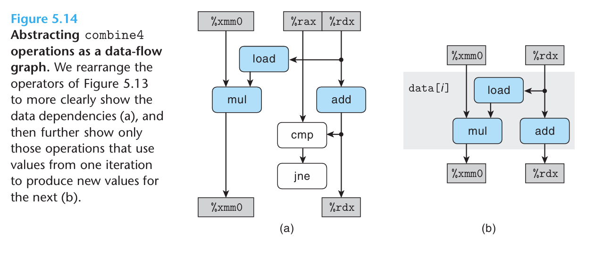
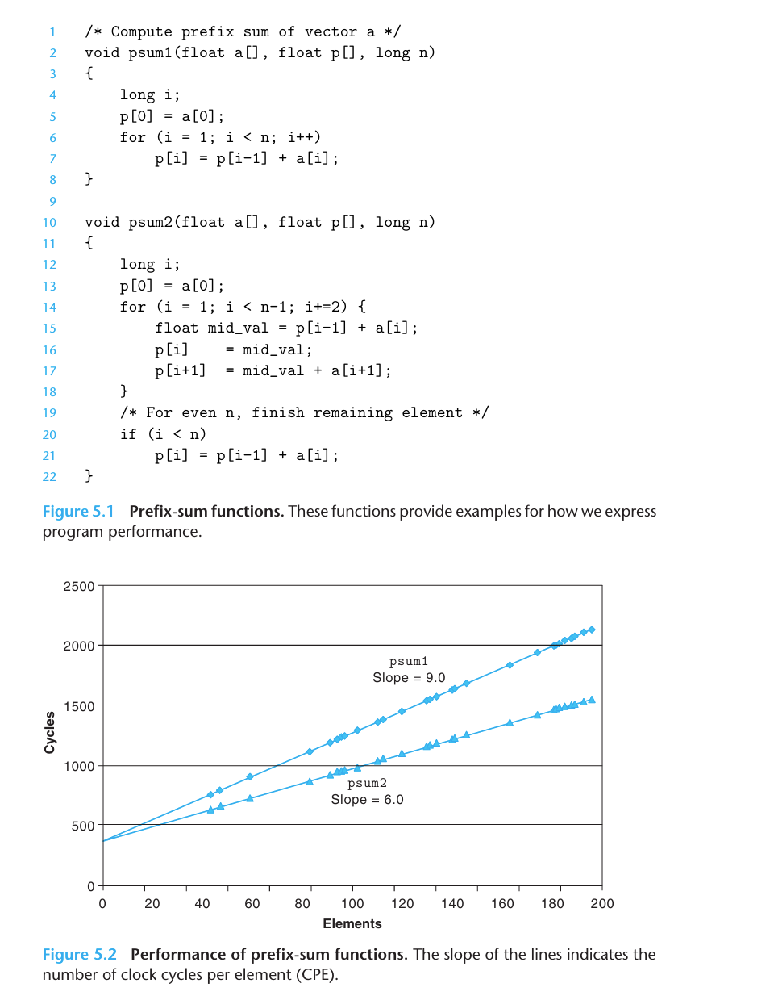
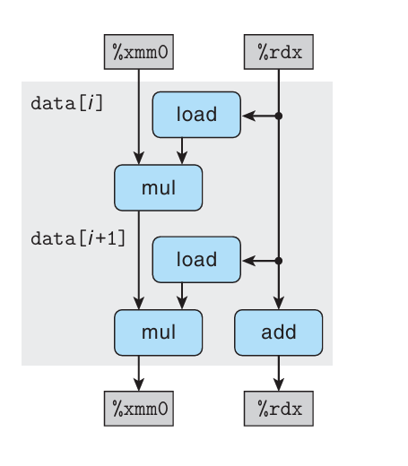
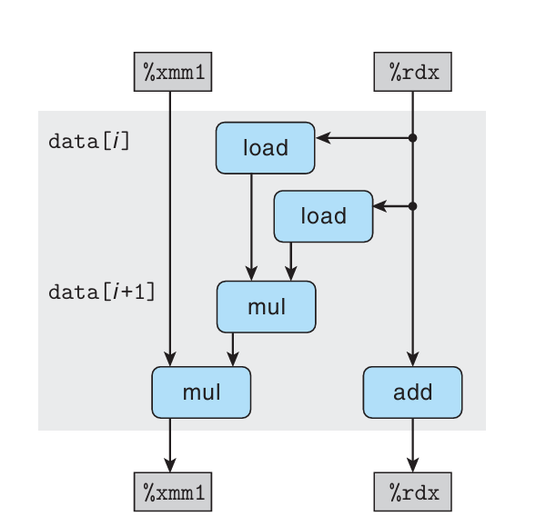

# CSAPP Learning
---

## **Data-Flow Graphs**

通过画数据流图，我们可以分析不同寄存器的数据流动。有这样4类：  
* Read-Only
  * 只读寄存器，它的值只会被**读取**不会被更改。
* Write-Only
  * 只写寄存器，它的值只会被**修改**不会被读取。
* Local  
  * 在循环中不断被修改使用，但前后更改没有必然联系。-> **条件码寄存器**
* Loop
  * 循环寄存器，又会被**write**又会被**read**。

制约CPU工作效率的是Loop这一类，因为它约束了指令运行的先后时序，这是程序优化的重点所在。

简化数据流图，**只保留影响制约运行时间的相关操作**



这个图里面，我们知道浮点数乘法单次执行的花费时间会更多。  
所以它的运行速度被左边 `%xmm0` 的线路所制约。

但是实际的运行效率，是不如我们分析得到的理论时间数据的，这也说明了**理论预测值只是一个下界**，实际的影响因素会更加多。

## **循环展开**


`psum1()` 方法里面，我们单个 `for` 循环里做的事情有：
* 从内存中读取 `p[i-1]` 到寄存器 # load
* 从内存中读取 `a[i]` 到寄存器   # load
* 计算 `p[i-1] + a[i]`          # add
* 把结果写进内存中的 `p[i]`
* 执行 `i++`                   # add
* 判断 `i<n? continue : exit`  

而在 `psum2()` 方法里面：
* 从内存中读取 `p[i-1]` 到寄存器          # load
* 从内存中读取 `a[i]` 到寄存器            # load
* 计算 `p[i-1] + a[i]` 得到 `mid_val`    # add
* 把它写进内存中的 `p[i]`
* 计算 `mid_val + a[i+1]`                # add
* 把结果写进内存中的 `p[i+1]`
* 执行 `i+=2`                            # add
* 判断 `i<n-1? continue : exit`

它优化了：  
* 每次循环算两个数，这样**读取**的任务量直接减半
* **减少各种杂务开销**，比如 `for` 语句的 `i++` 迭代与判断是否跳出循环  

**那我能不能无限摊大饼呢？**
* **有上限。** 太多了反倒会有让16个寄存器全被占满的可能性，这样的话多余的变量会存放进内存里，从内存存读会造成程序运行效率下降。

## **重新结合**
对比  

  


我们哪怕只是把  

`acc = (acc OP data[i]) OP data[i+1];`  

改成了  

`acc = acc OP (data[i] OP data[i+1]);`  

这样一个小的改动，造成了乘法计算上性能的巨大差异。

原因在，我们把 `%xmm0` 决速路径上所依赖的2步浮点数乘法给砍成了一步。

**启发**：尽量优化决速路径的执行时长，减少浮点数乘法直接计算。

## **读与写**

*如果读很影响效率，那么写呢？*  
* **写本身是不影响效率的。** 但是如果写之后这个内存位置上还要再被读，那就很影响效率了。
* 这被称为「写/读相关」。
* 并且，内存里面的写/读相关是要根据处理器计算地址的结果来确定的，**不如寄存器操作方便**。

## **分支预测**

虽然处理器的分支预测可能会导致一定的算力浪费，但是整体来讲对程序性能影响不大。  
**Do Not Be Overly Concerned about Predictable Branches.**  
如果要优化，可以参考第3章讲到的Conditional Move。

## **优化程序，从随手小事做起**
1. **减少函数调用**  

以前写的  

```C
for (i = 0; i < length(a); i++)
...
```  

都写成
```C
int len = length(a);
for (i = 0; i < len; i++)
...
```
2. **消除不必要的内存引用**

创建临时变量存储临时结果，最后再把这个临时结果写进内存中  
这是因为读取操作比较**费时间**，也比较容易有**依赖性**，我们需要减少不必要内存读取

***By Tab_1bit0***