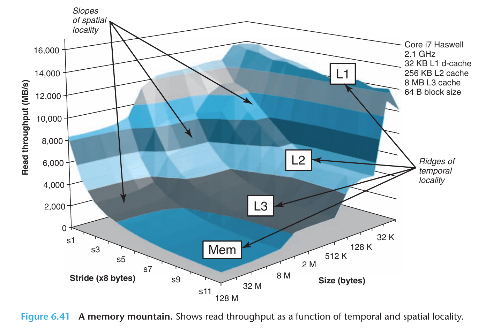

# CSAPP Learning
---
*This document is specially for Cache in Chapter 6 of book CSAPP.*
## **Direct-Mapped Cache**

现在我们假设有一个女仆咖啡厅，有1000个女仆服务员。

每天女仆要开始营业，先得拿着一个打卡机生成的**凭证**——**员工属性**，**用哪个衣柜**，**要什么配饰**，进入更衣室。

但是准备室里面只有10个柜子，每个柜子里**最多只有一组服饰**。

| 女仆咖啡厅前台 | 咖啡厅的后厨仓库 | 更衣室 | 柜子 | 凭证 |
| :-----: | :-----: | :----: | :----: | :----: |
| CPU | 内存 | Cache |Set ***S***| 要找的内存地址 |

| 柜子编号 | 放配饰的单位空间数 |
| :----: |:----:|
| Index | Cache Line ***E*** (equals 1) |

| 服饰有没有准备好 | 给哪种属性女仆用 | 服饰组 |
| :----: |:----:|:----:|
| Valid | Tag | Block ***B*** |

| 女仆属性 | 用哪个柜子 | 要拿哪一件服饰 |
| :-----: | :----: | :----: | 
| Tag | Set Index | Offset |

| 女仆可以营业了 | 女仆还不能营业 |
| :-----: | :----: |
| Cache Hit | Cache Miss |

我们可以发现：妹抖们想要开始营业，需要先
* Set Index**找到柜子**（组选择）
* 再让Valid与Tag**都能匹配上**（行匹配）
* 最后用Offset**找到想要的服饰**（块抽取）

才可以喵

如果行匹配失败了，就会触发**Cache Miss**，需要从**存储器层次结构的下一层**取出需要的块。（比如更底层的Cache）

ということで，今日も元気に笑顔でサービスできるために，  
配饰会从比如仓库等等地方送到女仆的衣柜里来Nyan~  

这里会有两种情况：
* Case invalid: **Valid被置0**，也就是说这个Block本身不可用。那么就会调用出所需要的块，并将它加载到这个Cache中，Valid位置1，Tag重置。
* Case Tag不匹配：调用出Tag匹配的相应块加载到Cache中，但是会把原本可用的块给覆盖掉，Tag重置。

***所以为什么我们要把Set Index放在中间位置而不是最前面？***  

当我们执行比如数组遍历调用的时候，我们的元素内存地址是**相邻**的，也就是说前几位相同的可能性很大。  
如果我们将相邻元素都让他们去到同一个Set，那么显然很容易**引发Cache Miss**，造成性能下降。  
而当把Set Index放在后面一些的话，就能够实现有效的分流。

此外，内存地址只是在Cache的语境下被赋予了 Tag/SetIndex/Offset 的**特殊含义**，它的本质含义是**最底层的内存位置**。

但即便如此，实际运行中仍有可能出现**抖动**的情形，映射到同个Set导致冲突频发性能下降2-3倍。但是解决也相对容易，比如更改相关数组的长度。

## **Set Associative Caches**
相比于Direct-Mapped，这次我们调整了更衣柜，让一个柜子能容纳更多套女仆装。  
也就是说Cache line的 1 < E < (C/B)。

那么当遇到不命中情况的话，究竟应该替换掉哪一个Cache line的block呢？  
有很多种优化策略，但需要更多的硬件和时间。  
但是相应地，底层的Cache Miss造成的时间成本或许很值得我们去优化。

## **Fully Associative Caches**
此时E = C/B，也就是说只有一个大的Set。
一般只会拿来做内存容量小的部分。

## **关于写入**
**Write-Hit**
* write-through 写穿透，把下面若干级都改动
* write-back 写回，只改高层cache（cache line需要添加状态修改位）

**Write-Miss**
* write-allocate 写分配，把底层存储的拉上来写
* write-not-allocate 写不分配，绕开高层改底层

## **参数的选取**
**Cache Line**数量增多：抖动发生概率降低，*访问速度降低*  
**Cache**容量提高：命中率变高，*访问速度降低*  
**Block**变大：同等容量下减少Cache Line行数，更好利用空间局部性，*Cache Miss的处罚变大，Block过大导致命中率降低*  
**写策略**：高层多用write-through，底层多用write-back

*可以发现，在实际设计中，一个CPU的各级Block大小是一致的*  
*虽然可以不一致，但可能会在具体传输中出现硬件寻址和状态机逻辑过于复杂的情况*

## **局部性 & Cache友好的代码**
* 时间局部性：某个内存位置的值可能被**多次**引用
* 空间局部性：某个内存位置**邻近**的值可能被引用

做法：
* 频繁使用**局部变量**，维持好的**时间局部性**
* 使用步长为1的数组遍历访问，维持好的**空间局部性**
* 多层循环嵌套的时候，关注执行次数最多的**最内层语句**

***By Tab_1bit0***