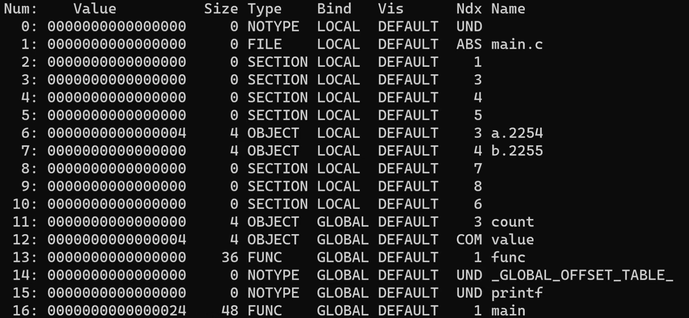
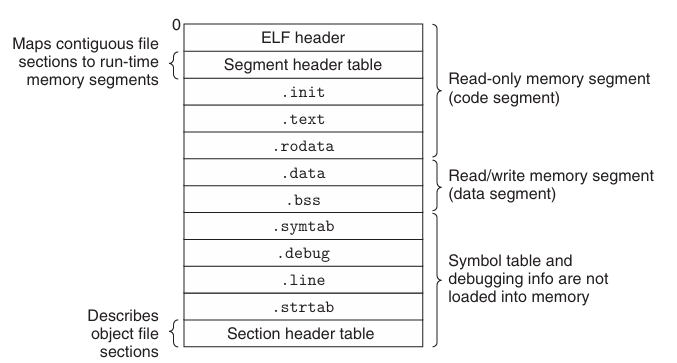
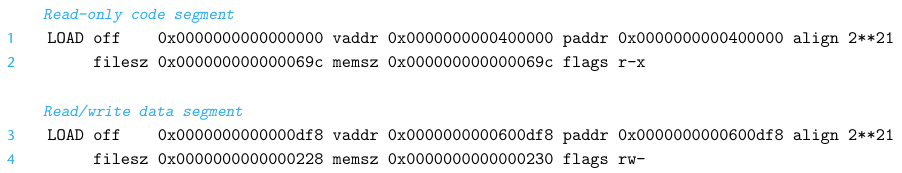
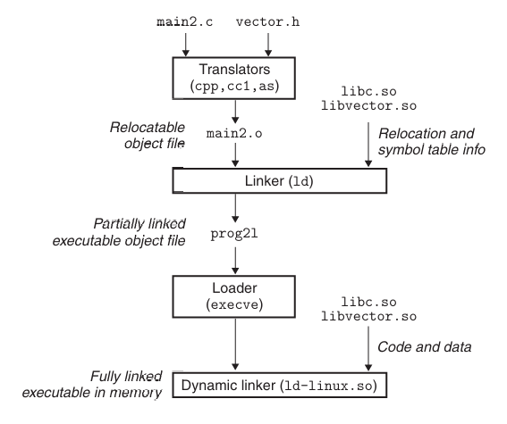

# CSAPP Learning

*This document is specially for Chapter 7 of book CSAPP.*
---

## 可重定位目标文件 Relocatable Object Files

可重定位目标文件是经过**编译+汇编**之后得到的 `.o` 后缀名文件。
包括三部分：
* **ELF Header**
* **Sections**
* **Section Header Table**

### ELF Header (Exceutable and Linkable Format)

**开头16个字节**：
前4个字节（魔数 ELF Magic）是
| 7f | 45 | 4c | 46 |
|:----:|:----:|:----:|:----:|
| DEL (in ASCII) | E | L | F |

作用：确认文件类型。
第5个字节表示位数，0x2是64位，0x1是32位。
第6个字节是端序，0x1小端序，0x2大端序。
第7个字节是文件版本号，一般是0x1。
剩下9个字节置空。

ELF Header包含**64字节**，剩下字节填充其他信息，例如Type可以是可重定位/可执行/共享文件。

### Section 节/段
* 先是 **.text**: 这里面是编译好的**机器代码**。
* 再是 **.data**: 这里面是已经初始化的**全局变量和静态变量**。
* 再是 **.bss**: 存放未初始化或初始为0的**全局变量和静态变量**，但它只是一个**占位符**，不占用磁盘空间。
* **.rodata**: 存放所有**read-only data**，switch语句的跳转表，printf语句的格式化字符串也都放在这里。
* 其他的一些信息，其中重点关注
* **.symtab 符号表**: 



  * **LOCAL** - 局部的静态变量
  * **GLOBAL** - 全局变量
  * **UND** - Undefined，不在这个.c文件里面定义的
  * **Ndx = 某个特定数字** - sections中某字段，其中**没有显式Name的都是section内部字段本身**
  * **COMMON** - 和.bss有小区分，COMMON只用来存放**未初始化的全局变量**，而.bss用来存放其他几类，这是因为链接多个文件时候可能遇到**全局变量重名**的问题，需要特殊处理
  * **OBJECT** - 数据对象，变量/数组
  * **FUNC** - 函数
  * **.2254/.2255** - 修饰项防止局部变量名冲突

*注意：*
* 非static的局部变量放在**栈帧**里面。
* .bss字段它并不占据 `.o` 文件的字段，这是为了让它**瘦身**，而不是说这些变量是read-only的，具体要申请的区块情况**写在了Section Header Table里面**。当程序开始运行了，相应的区块自然会被申请出来。

Symbols分为三类：
* Global Symbols，相当于cpp/Java中的 **public** 字段
* External Symbols，从外部引入的字段
* Local Symbols，即C中的 **Static**，相当于cpp/Java中的 **private** 字段

### Section Header Table

这是一个**描述不同Section属性的表**。

可以确认每一个Section的大小，在文件中的位置等信息。

## 链接起来吧！

链接的过程由**链接器**完成。

当链接的多个文件只编译了一个的时候，可以正常编译，但生成可执行文件时会出现**找不到符号**的情况。

### 当**全局变量重名了怎么办？**
我们规定，函数和已经初始化的全局变量为**强符号**，未初始化的全局变量为**弱符号**。
* 多个强符号：**报错**
* 一个强和多个弱符号：**以强为准**
* 多个弱符号：**未初始化，定义方法任意挑选**

实际上很显然，很容易出现**意料之外的程序运行结果**。

### `printf()` 等等函数是怎么被**引用**的？
在Linux中，用.a后缀名文件集成了一系列.o文件，例如 `libc.a` 中集成了 `scanf.o` `printf.o` 等一系列文件。
我们也可以人为的用指令集成.a文件，在编译是要手动导入它。

### 那么.h后缀文件做什么用？

**头文件声明了相关的函数的存在性。** 它是给编译器而非链接器看的。

链接器**综合了以上.o文件信息**，打包成一个大的可执行文件。

### 链接器的工作过程（静态库的解析）

输入 
```Shell
linux> gcc -static -o prog main.o ./libvector.a # 结束后自动引用libc.a
```

在生成prog这个可执行文件的时候，会按输入顺序从左往右扫读
* prog main.o
* ./libvector.a
* clib.a

可以分为**目标文件**和**静态库文件**。
这三个文件，并建立3个集合：
* E集合：**目标文件，以及使用了且定义过的符号对应的.o文件**
* U集合：**使用了但未定义的符号**
* D集合：**已经定义了的全局符号**

在读取的过程中这三个集合的元素会移动，最后会**只保留E集合中的元素**，确定要引用的文件。
如果U集合最后还是**非空**，那么会出现找不到符号的**报错**。
所以文件扫读顺序**可能会直接影响执行失败**。
静态库之间链状引用可能需要ABC的链接顺序，循环引用可能需要ABA的顺序。

### 链接器的工作过程（重定位）

分成两步：  
#### 第一步是**重定位节和符号定义**。  
把不同的 `.o` 文件Sections的各个部分合并得到一个**新的大的Section**。  
这里注意，ELF文件默认分配虚拟地址是从0x400000开始的。  

#### 第二步是**重定位Section中的符号引用**。  
所有调用不同文件中函数的 `call` 指令要**重新指向实际的函数地址**，这一步需要依赖**Relocation Entries**（重定位条目），它由**汇编器**产生，放在 `.o` 文件的特定位置，提供给链接器用。  
这个字段长这个样子：
```C
1 typedef struct {
2     long offset; /*Offset of the reference to relocate*/
3     long type: 32, /*Relocation type*/
4          symbol: 32;/*Symboltable index*/
5     long addend; /*Constant part of relocation expression*/
6 } Elf64_Rela;
```
***其实调用库函数，调用同一个文件里的非static函数，调用.data区域的变量等所有无法确定最终位置的事情，都会有重定位过程发生。***

* symbol: 要重定位的符号名字，比如sum() 函数就叫sum 
* type：重定位类型（共32种）重点关注
  * R_X86_64_32 **绝对地址重定位**
  * R_X86_64_PC32 **相对地址重定位**

先将callq 指令 e8后面的4个字节（表示引用地址）置空  

##### 对于相对地址引用  

有了这些信息之后，链接器便能够计算出引用的运行时地址（call指令放引用地址的位置）：  
$$ ref\_addr = ADDR_\text{Caller Function} + r.offset $$  

对于Caller Function的起始地址很容易得到，例如 `main` 常常是 0x4004d0。  
然后再把这个位置（设指针变量 `*ref_ptr` ）赋值：  
$$ *ref\_ptr = ADDR_\text{Callee Function} -ref\_addr + r.addend\text{(= -4 in default)} $$  

——这里注意这个值的实际含义：`PC(%rip)` 总是指向它运行的**指令的下一条指令**，存入这个相对偏移，实质上是把它定位到**调用的函数的第一条指令**中去。

在执行 `call` 指令的时候实际上发生了两个过程：
* 先把 PC 的当前值（原函数中 `call` 的下一条指令）压栈保存。
* 再修改 PC 的值，方法就是加上 `*ref_ptr` 的值。

这样我们不难理解**为什么r.addend默认等于 -4 了**，因为 `ref_addr` 和原函数中 `call` 的下一条指令隔着4个字节的距离。

##### 对于绝对地址引用

前面步骤和相对地址引用相同。  
第二步更加简单：  
$$ *ref\_ptr = ADDR_\text{Target Data} + r.addend\text{(= 0 in default)} $$  
它多见于**变量赋值**（涉及.data）的场合，相比于相对地址引用常见于**函数调用**（涉及.text）。

## 可执行文件 Executable Object Files

* **.init** 定义了一个 `_init` 函数，程序借助它实现初始化
* .rel.text/.rel.data都**不再需要**，因为已经重定位过了
* 其他都与可重定位目标文件相类似



### Section header table
它描述了**代码段**，**数据段**与内存的映射关系。同时也有可读，可写，可执行的权限表示。  



* off - 偏移量（位于可执行文件的哪个位置）
* vaddr & paddr - 开始内存地址
* filesz - 相关文件大小
* `flags r-x` - 可读，不可写，可执行

我们注意下面有 memsz > filesz，这是因为，memsz实际还加载了.bss字段中的内容。  
这里.bss**依旧是没有占用可执行文件空间的**，但是相应变量应当被加载到内存里，并被初始化为0。

要求 $vaddr\ \%\ align=off\ \%\ align$，目的是更快**访问内存**。

程序由execve从磁盘**加载**到内存。  
程序加载过程涉及到后面章节进程/虚拟内存/虚拟映射的问题。

## 共享库 Shared Libraries

思考静态库 `.o` 的缺点：
* 需要定期更新维护
* 一个系统可能运行成百上千个进程，如果要把比如标准I/O函数的静态库也通过链接器复制成百上千遍很占内存

共享库 - ` .so ` in linux and ` .dll ` in windows  
它能被加载到任意内存地址，和任意内存中程序链接起来，which is called 动态链接。

Dynamic linker 完成重定位的工作，主要是通过 GOT (全局偏移表) 和 PLT (过程链接表) 这两个数据结构来完成。

Dynamic linking 的优点：**运行时**也可以加载和链接——
* Distributing Software
* Web Server Of High Efficiency, which means Web服务器可以**不停服更新**