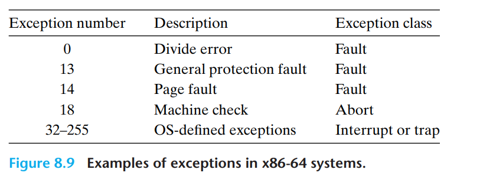
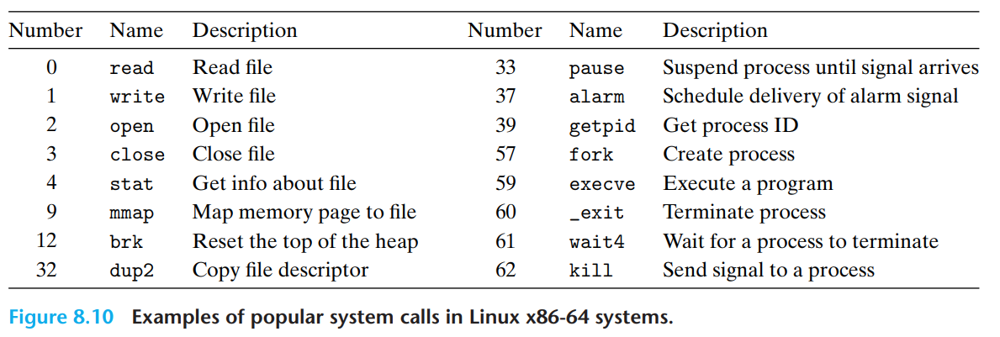
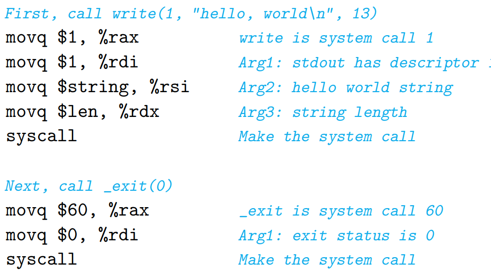
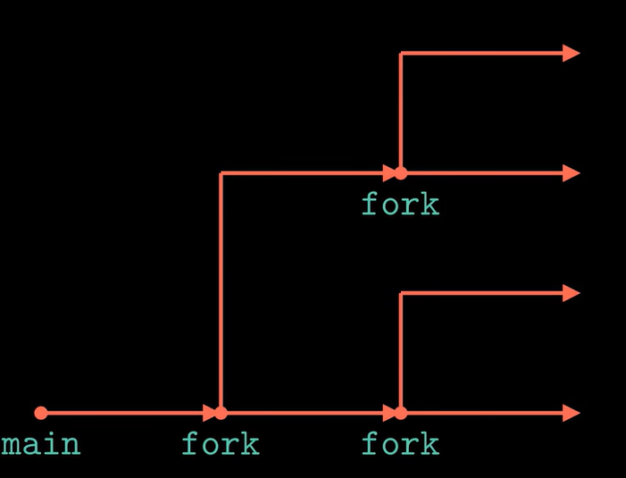
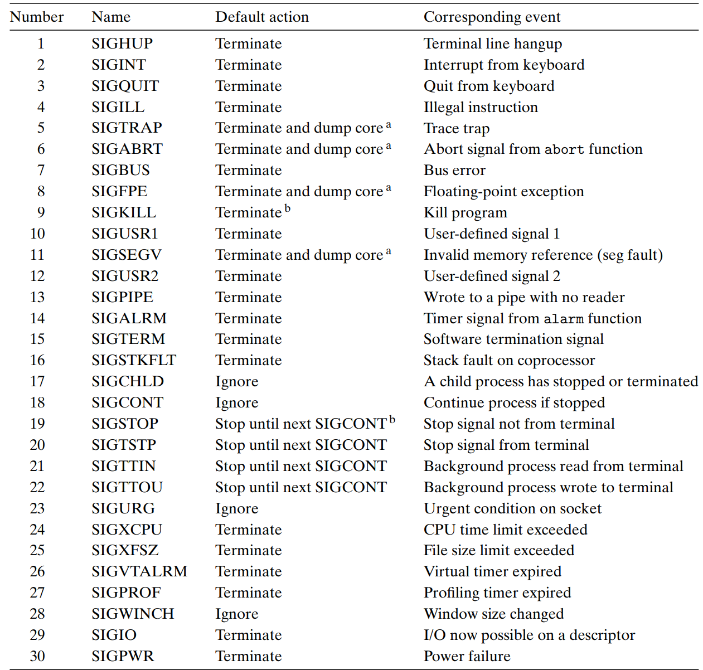

# CSAPP Learning

---
*This document is specially for Chapter 8 of book CSAPP.*

## 异常 Exception

CPU读取一串线性指令的过程是**控制流**(Control Flow)作用；每个编号a~k~对应I~k~指令的执行。

I~k~地址的不平滑突变可能是正常的jmp跳转，call指令等造成；

但是除此之外就是**异常**情况的发生，比如系统调用，IO输入输出流，StackOverflow栈溢出，它们会**中断**当前程序，把程序引向**其他位置**进行。

C++/Java可以使用 `try-catch` 语句进行**捕获异常**处理，这里的Exception和本章重点的操作系统/硬件的Exception有所不同；

在用户层底下**操作系统以及硬件**方面，有固定的一套异常处理程序，这套指令是**只要异常触发就会发生**的。  

操作系统定义了一张**异常跳转表** (Exception Table)，在系统启动时分配和初始化：
| Index | Pointer to |
|:----:|:----:|
| 0 | Code for Exception Handler 0 |
| 1 | Code for Exception Handler 1 |
| 2 | Code for Exception Handler 2 |
| ... | ... |
| n-1 | Code for Exception Handler n-1 |

CPU中会存放一个特殊的寄存器：**异常表基址寄存器** (Exception Table Base Register)，指向这个跳转表初始位置。
从而我们通过register+编号的方式定位到相应的处理程序。

异常处理相当于**特殊的Procedure调用**。
* 处理器**把当前或下一条指令**压入栈中
* 处理器**还会把一些特殊状态值**压入栈中
* 如果是转入系统内核，那么异常处理（包括压栈）不发生在用户层，其指令调用发生在**内核**栈中。
* 运行在**内核**态，有对所有系统资源的访问权限。

因为处理异常相当于**中断**了原本程序的执行。

### 异常有4种类型 (class)：

#### 中断 Interrupt
这是唯一一种**异步**情况，即与当前指令无关。  
例如键盘控制器引发的硬件中断，是检测键盘输入状态然后执行相应的处理程序，处理完成后回到原程序指令的**下一步**。

#### 陷阱 Trap
它为用户与系统交互提供**接口**，例如往磁盘读写文件，进行相应的处理程序，处理完成后回到原程序指令的**下一步**。

#### 故障 Fault
发生故障时候**系统**会先尝试修复故障，修复成功回到故障指令地址重新运行**这一条故障指令**；失败则**结束**程序。

#### 致命 Abort
这一般是引发了**硬件层面的故障**，会直接**结束**程序。

### 具体案例


* `Divide Error` 是除法错误，就是使除法器出现问题，例如除数为0。这种时候的处理方法一般是**终止**程序。  
* `General Protection Fault` 是一般保护错误，一般是程序接触到了**不存在或无权访问**的内存区域。这种时候的处理方法一般是**终止**程序。
* `Page Fault` 是缺页故障，一般系统会先尝试去**磁盘中读取缺失的部分**进行修复。
* `Machine Check` 是机器检查，一般反映硬件层面的故障。

这几个都是**芯片架构师定义的**。

### OS-Defined Exceptions

注意这张表格和上面所说的跳转表**不一样**，这些Number是**系统函数的调用编号**。
汇编中通过 `syscall` 指令来实现系统层面调用。

注意在C语言中`write()` 和 `exit()` 实际上是为 `syscall` 提供**包装**。

## 进程 Process
区分于**程序**，进程是一个被创建的**实例**。
作为一个单个的非实例的**程序**，我们会假设它
* 自由地占用虚拟内存地址
* CPU自始至终都只在处理它

但对于一个**单核处理器**而言，常常是多个进程**并发**执行。

**并发**不等于**并行**。  
* **并发**是指处理器的**同一个核**一直在ABC等持续的进程中不断**切换跳转**工作，这个过程中进程ABC**并发**。
* **并行**是指CPU的不同内核**同时**处理不同进程。

进程有三种状态：
* Running
* Stopped（通过**信号**(Signal)控制）
* Terminated（终止）引发包括
  * `exit()`
  * main函数返回
  * 终止信号

而进程依赖**逻辑控制流**工作，每个进程都有一个。

### 上下文 Context
**内核**为每一个进程维持一个**上下文**，以便于进程的挂起和恢复。
内部包括了
* general-purpose registers
* floating-point registers
* program counter
* user's stack
* status register
* kernel's stack
* various kernel data structures （页表，进程表，已打开文件的信息表）

内核可以**调度**进程，即抢占与恢复进程，通过**上下文切换**实现。

* 保存原来上下文
* 切换新的上下文
* 重定位控制流

这个过程发生在**很多个进程并发**，或者有需要**调用系统函数**的情况
但上下文切换花费的成本代价显然**非常大**。

### 用户模式和内核模式
通过Control Register这个**寄存器**维护**模式位**，标示当前程序权限。

内核模式可以调用任何内核指令，访问任何内存。
用户权限不能执行**特权指令**，如调用I/O，停止处理器，改变模式位等。
用户权限只能通过系统调用**间接地**访问内核的内存代码数据，比如**处理异常**，**用户模式**调用内核中的代码，这些内核中的代码在**内核模式**执行，最后回到**用户模式**。

### 子进程与fork()函数

在父进程中执行 `fork()` 函数会拉起一个和父进程相同的子进程，所有信息一致，但是存在内存的不同**实际位置**。
*我们该如何区分父进程与子进程同一位置的这个函数呢？*
* 在父进程中，`fork()` 函数会返回一个子进程的标识码 `pid` (>0)
* 在子进程中，`fork()` 函数会返回0，并且是从这一句fork开始起执行。
* 这就是*调用一次，返回2次*的特殊性。
如果我们执行
```C
/*in function main()*/
printf("This is the father process.\n");
fork(); // #1
fork(); // #2
printf("Hello, World!\n");
```
它实际上执行方法：

这四个hello的输出，由于**并发执行**的原因，实际顺序具有任意性。

### execve()函数
输入一次不返回，包括3个参数：
```C
const char* filename; // 启动文件名
const char* argv[]; // 命令行启动参数
const char* envp[]; // 环境参数
```
它负责调取**加载器**，**覆盖当前进程**，比如把shell用新的某个进程覆盖掉。
比如从Shell中运行可执行文件。

### waitpid()函数
进程结束后还是会赖在内存里占用空间，称为**僵死进程**。
父进程中的 `waitpid()` 函数可以回收清理这些僵尸进程。
它有三个参数
```C
pid_t pid;
int *statusp;
int options;
```
返回值是**被回收子进程的pid**。

* pid = -1: 监控所有子进程
* pid > 0: 监控特定pid子进程
指针\*statusp指向对子进程监控状态，即退出情况，具体可以通过`wait.h`中宏查询。

pid = -1时，子进程的回收也具有**顺序任意性**，需要代码人为约束。

此外注意，调用`waitpid()`时候，父进程**暂时被挂起**，需要等待对应子进程结束。

### 进程组 process group
一般子进程与父进程隶属于同一个进程族；也可以使用 `setpgid(pid_t pid, pid_t pgid)` 人为设置。
这里当
* pid = 0: 不改pid
* pgid = 0: 使用进程的pid值作为pgid值

使用 类似 `ls | sort` 创建**作业**会给作业分配不同的进程组。
（这句指令的意思是把 `ls` 的输出喂给 `sort` 进行输入的管道）

## 信号 Signal
是**用户层**的软件形式的**特殊异常**。

### 发送信号
* 键盘：Ctrl+C终止前台进程；Ctrl+Z挂起前台进程
* Shell：
```Shell
    /bin/kill -9 11111 #杀死进程号11111那个
    /bin/kill -9 -11111 #杀死进程组11111里面所有进程
```
* 进程内部调用函数kill()
* 进程内部调用函数alarm()
### 接受信号
进程从 kernel mode 变成 user mode 的时候会触发检查，如果待处理集合非空，会**挑选信号编号最小的一个施加**给进程，在系统层面**执行默认行为**，或者如果被程序捕获，会转到用户层的**信号处理程序**。

有四种预设的**默认行为**：
* The process terminates 进程终止
* The process terminates and dumps core 进程终止并转储内存（到磁盘上）
* The process suspends until restarted by a SIGCONT signal 进程挂起直到被唤醒
* The process ignores the signal 进程忽略该信号

信号处理过程类似于异常处理。
注意：
* 一种类型的待处理信号只会存在一个，剩下的会被丢弃
* 信号处理程序**可以被其他信号处理程序中断**

*如果有好多个信号怎么办？*
在某个信号处理程序执行完之后，会先切到kernel mode再切回user mode以**刷新状态**。

缺点：
* 信号处理不是时间先后顺序
* 对于Unix而言不同版本系统处理信号方式也不同

## 细节与补充
### Signal, Exception, try - catch 这三者是什么关系？
Signal 是**内核层面**向**用户层面**提供的信号，类似于**交通信号灯**，除了类似于 `SIGKILL` 这类的强制性执行默认动作，其他都可以在编程语言中捕获并自行处理。  
CSAPP书中有一个**案例**，其中Signal在**指挥交通**，保证父进程在子进程结束后继续执行下一步。再比如 `sigsuspend()` 方法也行之有效。
Signal和它的捕获处理方法具有**异步性**。

Exception是**硬件层面**异常。其中的Abort类型和Fault类型在出错时会**最高权限地打断**进程执行，而不是像Signal可以被捕捉重新处理具有**妥协性**。
但是我们调用系统函数 `trap` 类型如果遇到了错误情况，并不会强制像fault这样直接爆掉，而是会提供错误码和错误信息**返回给用户层**。
这些信息经过(JVM等)进一步处理，是可以被**try-catch**捕捉到的。

`try-catch` 语句具有**同步性**，它必须需要**主函数执行到了某一个特定区块**才能触发。并且 `try-catch` 这些异常都是在C++/Java语境下定义的**高级层面上的异常情况**，即便它们本质上可能是一个trap意外的**包装**。

案例：*`java.io.IOException` 的工作原理就是系统发出来的错误情况提供到了JVM上。*

### 为什么我shell里面运行完一个文件最后还会回到shell进程里面呢，execve()不是覆盖了原进程吗？

Shell后台使用了指令组合：
```C
fork();
if pid == 0 then execve(...);
waitpid(...);
```
Shell它`fork`出一个子进程，再把这个子进程用`execve`覆盖掉，并且用`waitpid`暂时挂起父进程，最后清理。

### Signal的异步性让我想到了javascript里面的addEventListener()的监听函数，这个两者间有什么关系？

浏览器底层有一个大的while True循环叫做**Event Loop**，它负责接受各种信号并转化成对应的**Event**，将它们按时间先后存放到序列中，不会被覆盖，并且这样处理之后**这些Events它们无权中断运行中的任何进程**。然后Event Loop 通过**调用回调函数**来唤醒对应的**监听函数**进行工作。

### 怎么区分前台进程和后台进程？
在同一Shell下，前台进程一般只有一个进程或者（不一定是整个）进程组。
`ls | sort` 案例中，ls和sort是同一个进程组，但是和Shell不是同一个进程组。运行的时候ls和sort都活跃在前台。

---

***By Tab_1bit0***