# CSAPP Learning

---
*This document is specially for Chapter 7 of book CSAPP.*

## 虚拟地址

在程序层面的假象，与物理层面的**物理地址**相对。比如 `main()` 函数总是在 `0x400000` 开始，但物理上不可能是这样。

在**虚拟寻址**的过程中，从虚拟地址到物理地址的翻译是由操作系统中的**Page Table**（页表）维护，硬件上CPU的**MMU**模块充当检票员。

虚拟地址与物理相对，它仅代表一种**内存管理技术**，并不代表任何**物理电路意义上**的内存地址。

虚拟地址包括
* 虚拟页号 VPN - 定义是哪个虚拟页
* 虚拟页偏移量 VPO - 确认是哪个字节

## 虚拟内存 Virtual Memory

也是一个抽象的概念，包含2^48^字节的**连续空间**，每一个字节都有对应的**虚拟地址**索引。

### 虚拟内存空间 VMA

这个是虚拟内存具体**落实到RAM的特殊区域**上的**具体存在形式**，具体可见下面的Linux管理案例。它只是一个*记账本*，**每个进程**都有一个。

### 页表，虚拟页，物理页

在大体量的磁盘和内存之间也存在有一个**最小传输单元**，总容量为P，即虚拟页。
显然**每个进程**的虚拟页都是**独有的**。
在物理内存上有一个与之对应的P容量的单元，即物理页。
两者不是线性平行的映射关系。
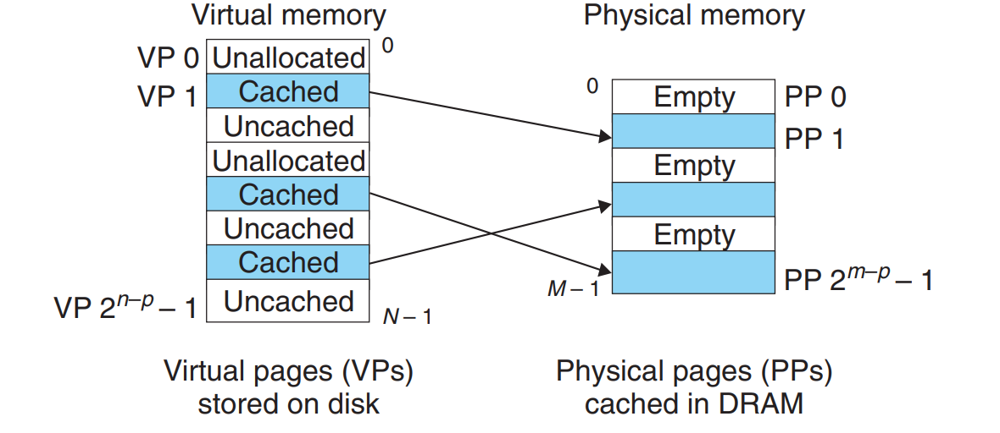
* Unallocated - 未分配
* Uncached - 未缓存
* Cached - 已缓存

不同的进程之间可以**共享**某块物理内存地址，页表做的事情是提供映射。

### SRAM & DRAM
我们区分CPU内部的L1/L2/L3 Cache 为SRAM，内存条（主存）为DRAM。  
事实上主存自身就是一个巨大的**缓存**。它有以下特点：
* 访问开销大，不命中成本高
* 采用全相联策略
* 复杂的不命中替换算法
* 采用write-back而非write-through策略

### 优势
* 简化了加载/链接器链接工作/内存分配/共享区域
* 有利于内存数据保护

### 那么页表有几个呢，又存在哪里呢？
显然每个进程有一个页表。  
进程运行时**存在DRAM里，但是**显然访问DRAM很慢，所以在MMU内部有一个小的缓存性质的SRAM，即TLB (translation lookaside buffer) 来提供更快的查询功能。

## 地址翻译 Address Translation
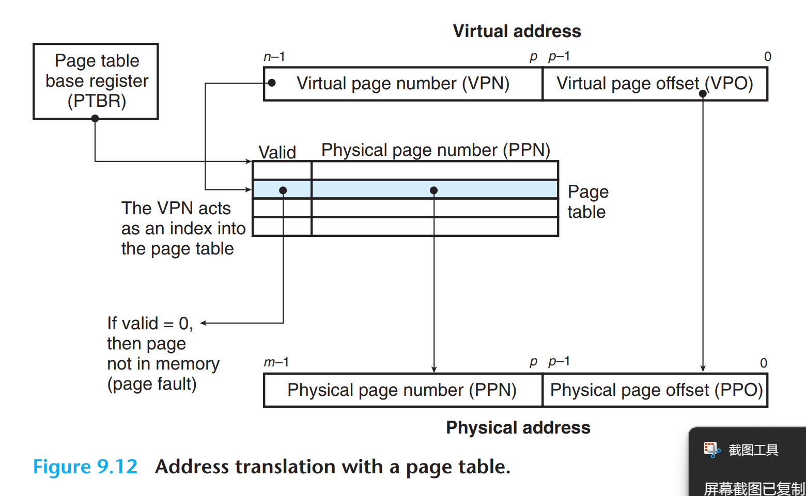

分步拆解开看有：
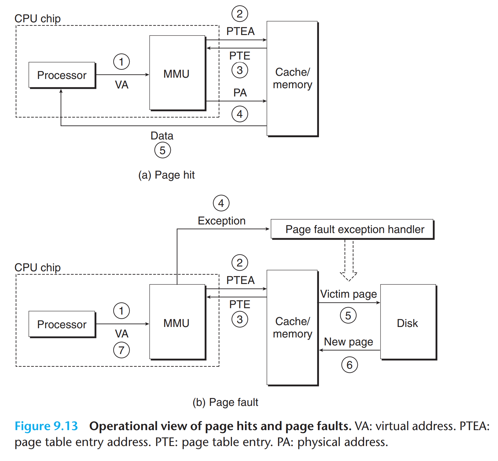

注意到Page Fault的情况，这里和上一章所讲的**异常处理**有直接相关性。

总而言之，这一系列内容的原理与**之前所学的**CPU，Cache等等知识是相贯通的，理解了那些原理这里也能很快明白。

### 优化方法

#### TLB
相当于多一级缓存。这个检索过程中，VPN被分成 TLB Tag 和 TLB Index。（回顾缓存的相关知识）
注意具体的数据仍旧是要通过缓存主存来调取，这和查页表**是两个独立的过程**。我们这里，包括多级页表，是优化了查页表的过程。
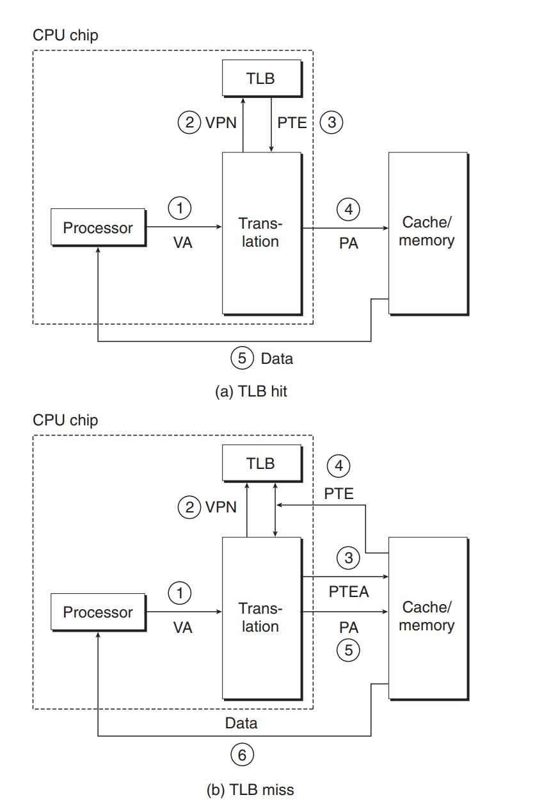
#### 多级页表
单个页表有**要求存储空间大，访问麻烦**等潜在问题，我们需要用**多级页表**把它拆分开。
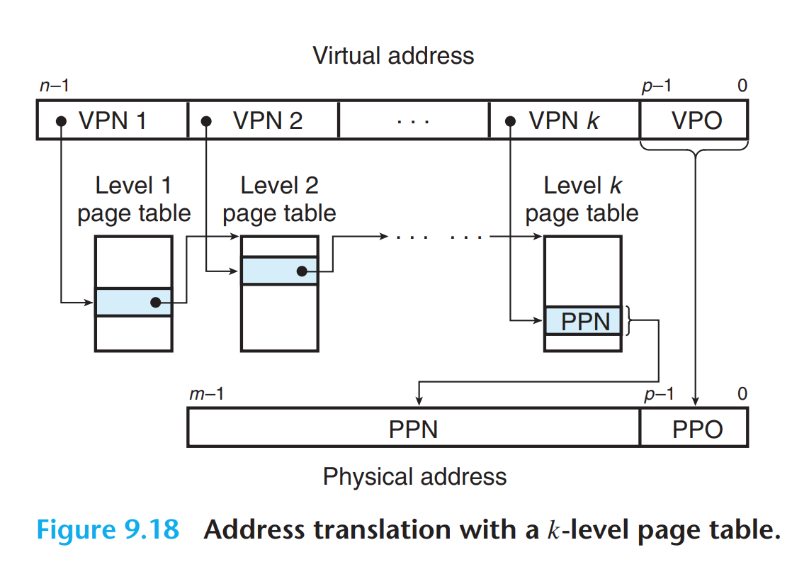
Level 1到Level k-1 都是指向下一个页表的**物理基地址**，通过它和VPN结合访问又能够得到下一级，以此迭代。
VPN被拆分成VPN1~VPNk来识读。
优势：
* **不存在就不创建。** 页表的创建自高向低，和其他缓存数据的工作原理一致。
* **不需要连续内存。**

*那么TLB和多级页表之间有什么联动吗？*
**TLB**一直会指向最高层级的即实际的物理地址。多级页表只是优化了去内存查找页表的这部分，优先级显然没TLB高。

### 案例
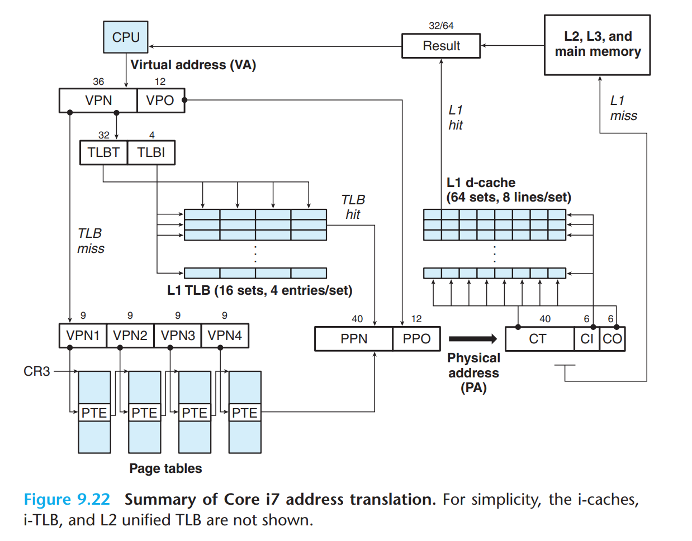
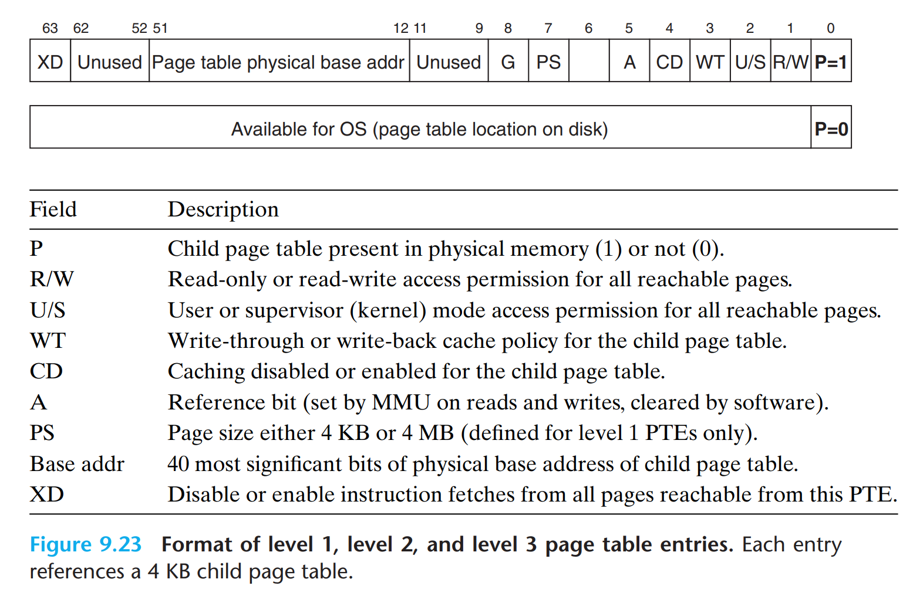
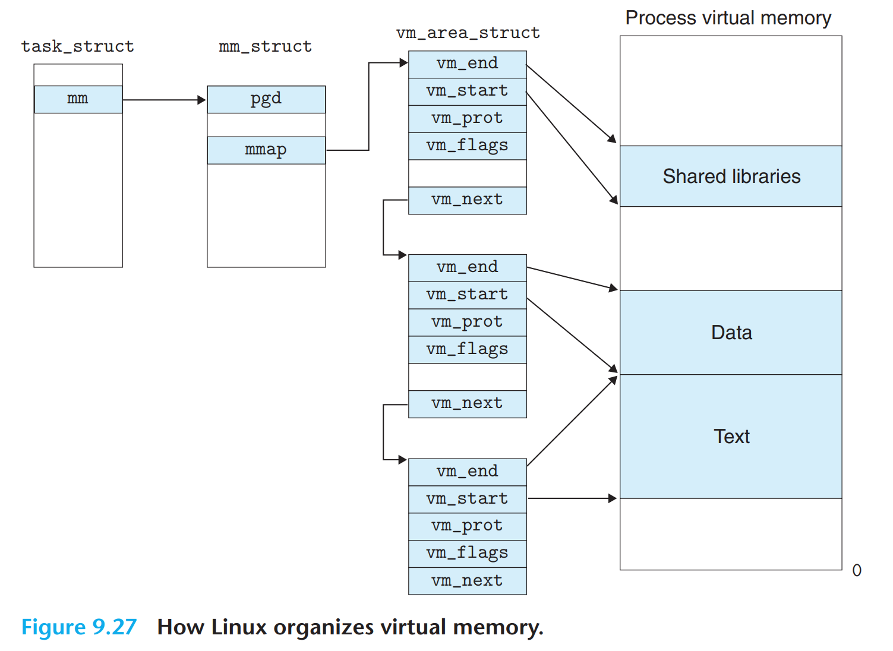

也可以看出，我们如何人工地赋予64位地址一个**实际意义**也是设计的重要一环。

#### 我们不是说每个进程的虚拟内存都应该是连续的吗，为什么我看书上Linux案例的空间好像并不连续呢？

要区分**虚拟内存**和**虚拟分配**的概念差别。
虚拟内存就是我们理想的0\~2^48^-1的连续地址空间，但是我们不可能直接把这一串东西直接存到磁盘里面去。
因此我们需要**虚拟分配**的方法保存在**RAM**里面，也就是说先把一整个连续的虚拟内存划分成**不同的虚拟页**，并附带有描述属性的相关信息（读写权限，或是链接的下一个页面等），然后执行**分配**的策略。
此外注意：VMA也是存放在**RAM**而不是磁盘当中的。

## Memory Mapping
*Linux initializes the contents of a virtual memory area by associating it with an object on disk, a process known as memory mapping.* 也就是说，它关乎**虚拟分配本身的实现机制**，即如何**磁盘**的文件与**RAM**上的Virtual Memory Area之间的链接。
Mapping可以关联普通的文件，也可以关联匿名文件。如果关联了匿名文件，那么就会直接调用**内存**而不经过磁盘。如果把它从内存踢出，那么就会进入到系统管理的**swap区**的特殊隐藏分区，待有需要再调用。

### Shared Objects /Private & COW
一个对象可以以共享(Shared)或私密(Private)的形式出现在RAM上。
如果是Shared，比如C库，那么可以**不同进程同时指向同一个物理内存地址。**
不同进程对它在物理内存上的数据都有写的权限，并且在一个进程中写会**影响**到另一个进程。这个写会**影响到磁盘上的源数据**。

* 那如果我只想在B里面做一些自己的修改该怎么办？

这个时候就是Private作用的时候，
使用**COW(Copy On Write)** 的策略。  
在物理内存上专开一片地方存放特殊修改的内容（这个过程叫做**复制**，最小单元就是page，由VMA和PTE的**读写权限不一致**引发的处理程序造成），并且只有做了对应修改的B才可见。此改动不写回磁盘，也不会对原数据做任何覆盖操作。

*注意区分：Shared/Private只是在**读写权限和效果**上的区分，它们本身是完全**可以**通过页表去指向同一个内存区域的。*

### 重新审视fork()和execve()
* `fork()` 函数实质上创建了一个mm_struct, area structs, page tables的复制给子进程（注意**物理内存并没有被复制！**），并设置成private & COW的对应权限。
 * `execve()` 函数则是把先前的这些信息全部**弃用**，重新建立磁盘到物理内存新的映射。

这两个过程中**所有的数据都没有在磁盘层面上被改动过！**

### mmap()
用户可以通过mmap()函数自己向磁盘中做Memory Mapping工作。
```C
void *mmap(void *start, size_t length, int prot, int flags,
int fd, off_t offset);
```
`prot` - 访问权限
`fd` - 文件描述符，如果是匿名映射 `fd` 与 `offset` 均置0即可
这样我们就可以往某个**特定文件的特定字节**去写入内容，访问改动更加高效。

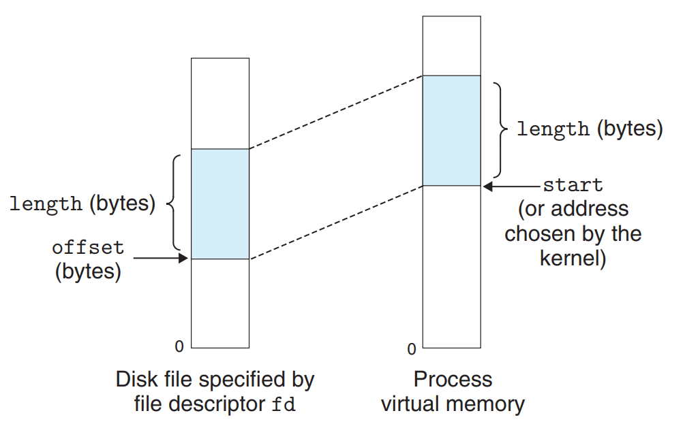
munmap()则可以移除。

## 动态内存分配
### malloc() & free()
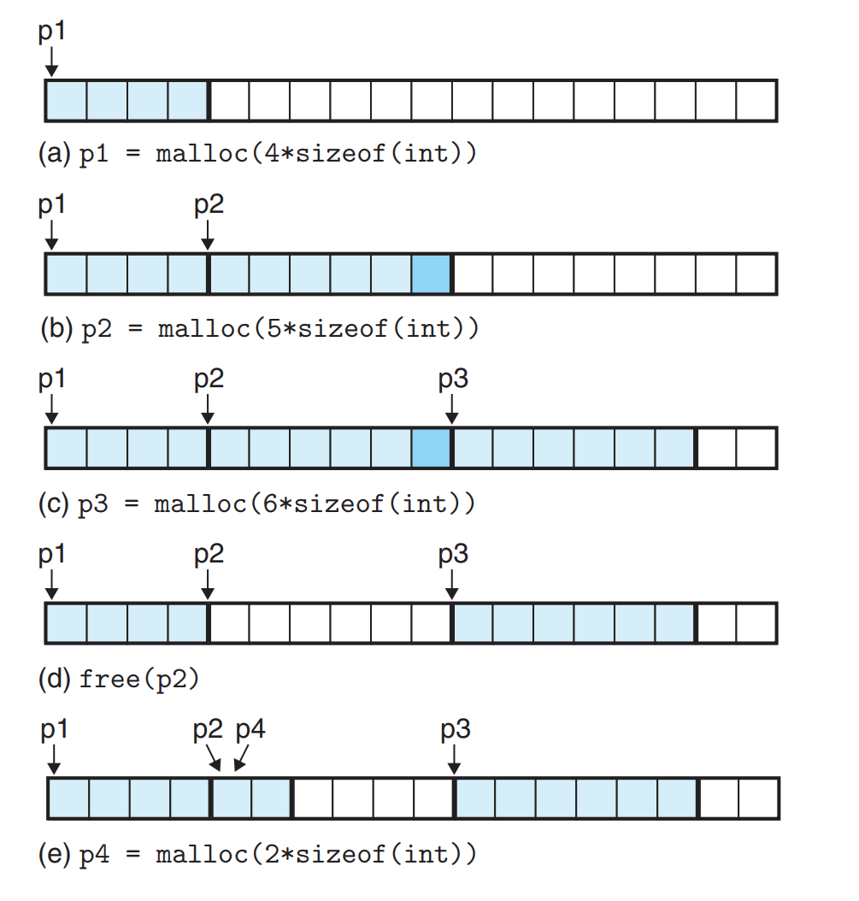

这里 `malloc()` 分配虚拟地址所使用的是**堆区（Heap）**，`malloc()` 使得它从低地址向高地址生长，要求分配地址8字节对齐。

`malloc()` 返回块地址，需要另行储存，查找可达到O(1)复杂度。

所以它的特点是**轻量、快速、与VMA结构不冲突**。目标在
* 最大化吞吐量
* 最优化内存利用率

*从整体上看，malloc()本身的功能实现也是借助于Virtual Memory/ Page等管理方法实现的，所谓的动态分配只是对Heap区的利用。* 

### 内存碎片 Fragmentation
* Internal Fragmentation - 内部分配的块大小比实际载荷大
* External Fragmentation - 多次分配后造成的零碎内存

这引发了在分配管理上我们要解决的额外难题。
* Free block organization
* Placement
* Splitting
* Coalescing
#### 解决方案1: 隐式空闲列表 Implicit List
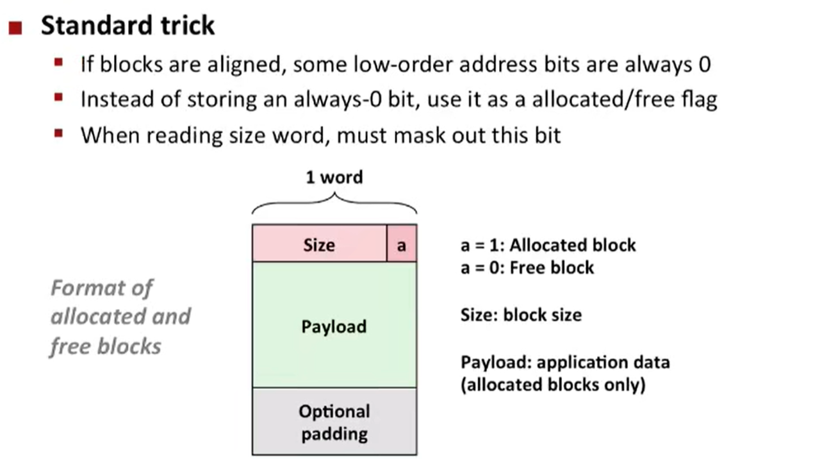


优点在：
* 利用了**双字对齐**特性，存size最低三位必定是000，这样我们可以利用最后一位存是否启用，并且通过位运算很方便地提取出size()
* 可以自由选定分配块大小
* 可以记录是否启用，padding信息
* 结构简单(Simplicity)

最主要缺点是 `malloc()` 与 `free()` 都是复杂度O(n)，时间效率低。

##### 放在哪里？
* First fit - 从头找符合，缺点是会造成较低地址区域的大量碎块
* Next fit - 从上一次访问的位置开始往下找，缺点是空间开销变大
* Best fit - 遍历整个动态内存分配，缺点是时间开销大

##### 分配多少块空间？
空闲块切割出一部分分配，剩下部分依然空闲。

##### 合并空闲块
把相邻的空闲块合并成大块。我们引入了Footer。

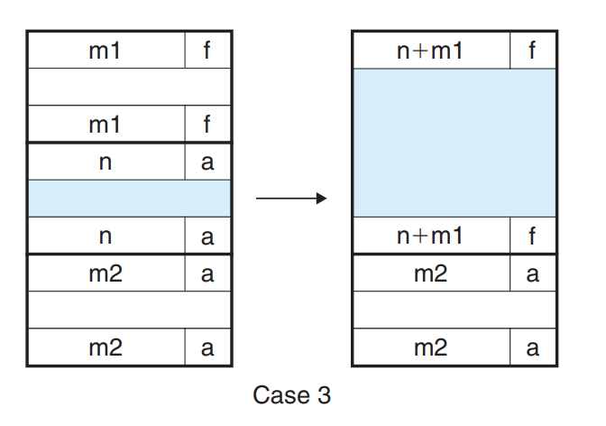

#### 改进：显式空闲列表 Explicit Free List
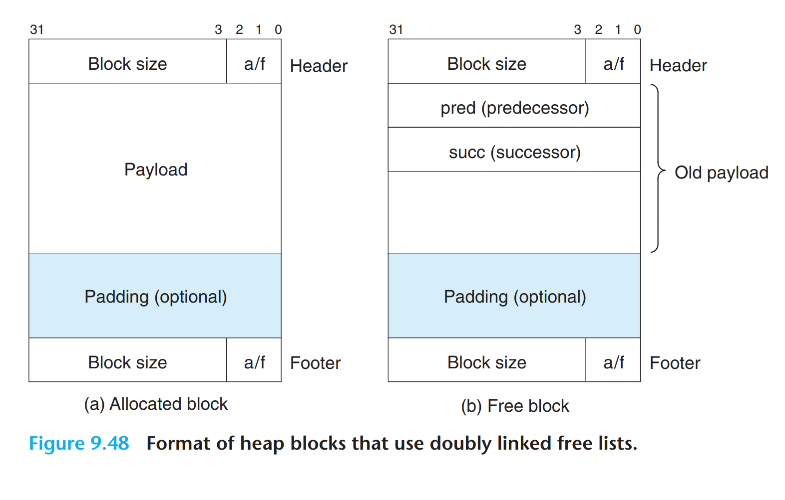

通过`pred` `succ`（前驱/后继）的双向链表设计来链接空闲块，提高访问分配效率，并能把 `free()` 复杂度降为O(1)。

#### 解决方案2：(Simple) Segregated Free List 分离空闲列表
{1}, {2}, {3, 4}, {5–8}, ... , {1,025–2,048}, {2,049–4,096}, {4,097–∞}  
或者（单位：字长）：
{1}, {2}, {3}, ... , {1,023}, {1,024}, {1,025–2,048}, {2,049–4,096}, {4,097–∞}
意思是说我们把一整个Heap区域进行分层处理，每一层都有一个特定**指针**。  
上面情况中，首先 `malloc(6)` 根据双字对齐，应该需要8字节的空间。会给它分配相应的块，**返回**这个块的位置，这个值需要**另行保存**以供查找修改。

但是到了 `free()` 环节，才是这些**分组**和**指针**上场的时候。  
这个时候分层的链表才会去把 `free()` 的对应区块给插入到相应链表**头部**。
这意味着每个块的大小**至少要放得下这个8字节指针**。

因此**分配块的逻辑**：
* 它先去找**对应分组的头指针**，如果有元素直接按照链表分配其头部；
* 如果没有，那么会分配一块堆区顶部的新区域。

*allocated blocks require no headers, and since there is no coalescing, they do not require any footers either.*

**优点**：可以用O(1)时间复杂度方便查找。

**缺点**：所有的free了的区块无法合并，可能导致不必要的碎片和空间浪费。

#### 改进：Segregated fit 分离适配
这才是实际Linux GNU的 `malloc()` 方法所用的机制。
理论基础：每个组只是一个**区间描述**，块与块之间可以合并分裂。
虽然分配块的时候执行first-fit，但是只在最坏情况下才达到O(n)时间复杂度。
*注意：此时free()的时候除了要填入 `succ` 指针，也要留出header空间描述块的大小。*

##### Buddy Systems 伙伴系统 
要求每个块的大小是2的整数次幂。
（此外注意我们人为的规定了大小为2^m^的块，它的**堆区起始地址的末m位为0**，以保证相应倍数关系）

在需要分配的时候，如果在某一层没找到：
它会到**更大的一层**去找有没有空位，如果有（比如32字节找到了64字节）：

**这个64字节的空间会被分割成2个32字节的空间，进行再链接和分配。**

*为什么这个操作速度快？*
一个64字节分出2个32字节。
然后我们可以得到，两半的地址分别在  
`...100000` 与 `...000000`。要找到对方，只需要做一个简单的**异或**运算！
合并机制：两半可以找到彼此后重新**合并**。

我们这样既兼顾了**free()的效率**（最坏有可能退化成log(n)），也保证了**空间的充分利用**。  
而实际 `malloc()` 的效率在合理的分组下，最坏也只是log(n)。
缺点：比如33字节会最后分配到64字节空间，产生了新的空间浪费。

### Garbage Collection 自动回收
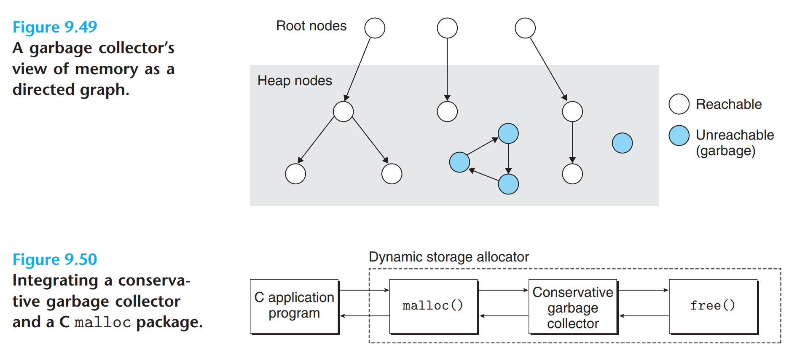

我们调用 `malloc` 时，free的工作是Conservative garbage collector **自动接手**的。

#### Mark & Sweep
通过 `Mark` 从根节点标记染色遍历到的节点，`Sweep` 将没有上色(Unreachable) 的节点给 `free()` 掉。

*所谓根节点指针是怎么来的？*
全都是**用户保存**在运行时栈中的变量/寄存器/全局或静态变量，GC在Mark的时候会从这些东西开始扫描。

遇到的问题是：
* 没有办法明显区分访问到的地方**是不是指针**，还是一个地址标记
* 即使是指针也没有办法界定它指向**哪一个位置**（可能是一个块的内部而非头部）——因为这个指针可能是**用户自己定义保存的**

为了解决后面一个问题，我们会对每个节点的Header加上左右指针，并建立地址大小的**平衡的二叉搜索树**。（注意这里和上面讨论的无GC情况略有出入）

从而对于**任意一个扫读到的类似地址8字节数字**，我们可以借助二叉搜索树锁定**它是否在某个合理的内存范围内**，如果在就可以Mark了。

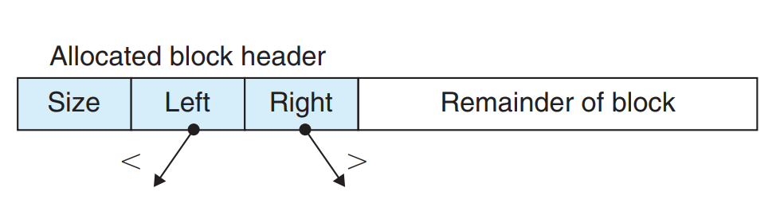
(能看出来header应该要24个字节长)

"Conservative"的意思是，这种情况很有可能free不干净。比如某个块内部的数值冒充了指针，还正好对上某个**事实上**unreachable块的地址，那么这个块也不会被清除掉。

*我们这里的工作是为了扫整个内存块的GC着想，和上面手动malloc&free的情况不同。*

另外有一个细节问题：我创建数组最后返回的是**指向下标为0的元素的指针**，而我的header部分在前面，那我想要利用到这个header的信息，我在Mark扫的时候**必须要考虑到这个偏移量Offset的因素**。

### 常见内存问题
第一个是
```C
scanf("%d", &val); //注意&，我们传入的是格式化字符串
```
第二个是堆区内存**不总被初始化为0**，要初始置0应用 `calloc()`

第三个是**栈缓冲区溢出**，用 `fgets()` 优于 `gets()`

第四个是 `char*`（指针） 和 `char`（数据类型） 大小不一样。

第五个是**数组下标越界**。

第六个是 `(*size)--` 与`*size--` 的区别。

第七个是**指针变量**应该 `p++` 而非 `p+=sizeof(int)`。

第八个是**返回被弃用的栈指针**（野指针）。

第九个是访问了已经被 `free()` 掉的块内容。

第十个是内存泄漏，某些情况不手动 `free()` 掉导致**堆区越堆越多**。

---

***By Tab_1bit0***