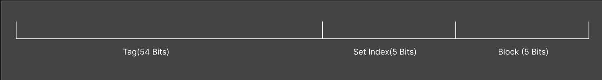
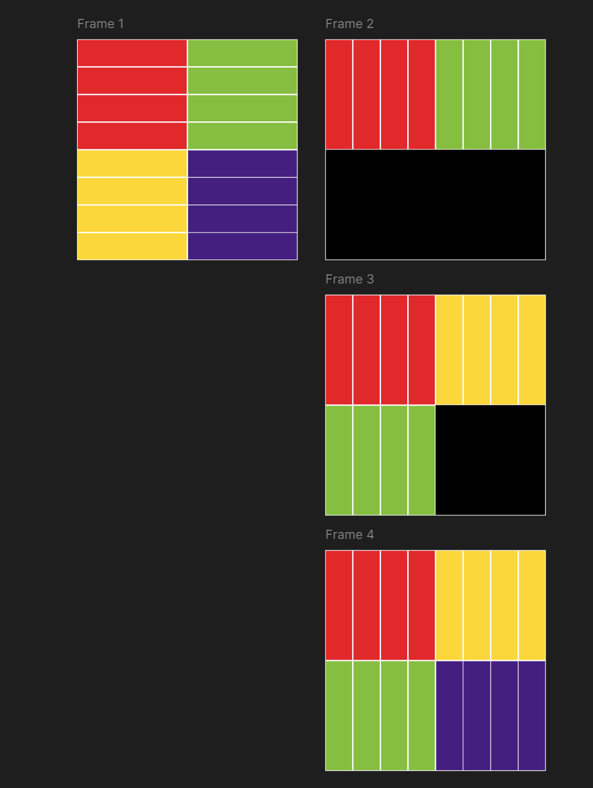

# CSAPP Learning

---
*This document is specially for Cachelab of book CSAPP.*

## PartA Writing A Cache Simulator

这一部分其实比较简单，主要得熟悉一下C语言里面**命令行参数读取**，**文件读取**，**指针**，**结构体声明**，**malloc**的写法

读东西的活全部扔给LLM做了，我是 :pig: 

发现几个比较有意思的点：
* 如何分出64位内存地址的Tag/Set Index/Block，这里要用到之前学过的**位运算**
* 通过Set Index做的寻Set过程依然类似于下标寻址，它的访问复杂度是 $O(1)$
* 但是具体处理下标里的E个cache line，访问需要遍历，复杂度是 $O(E)$

---

## PartB Optimizing Matrix Transpose

这一部分我们需要优化三个尺寸的矩阵转置函数，测试使用的是S=5，E=1, B=5的direct-mapped形态：
* 32 * 32
* 64 * 64
* 61 * 67

instruction里面明确的提了
>  Blocking is a useful technique for reducing cache misses.

---

### **问题1：** 为什么Blocking是有效的？  

同一个CacheLine里面可以塞下32个不同的内存地址，一个int占4字节，一个Set里有一个Cacheline，  
所以我们有，一个Set里面可以塞32/4=8个 int。 

比如对于一个32*32的Matrix，我们现在读 `A[0][0]` 读进了某个Set，意味着我们把 `A[0][0]` 到 `A[0][7]` 全部放进了这个Set里面。  

我们对这个过程来看，是人畜无害的，`A[0][0]` 到 `A[0][31]` 会进入4个不同的Set里面。  
接下来会把这一些值给赋值进入 `B[0][0]` 到 `B[31][0]`。  
这个时候就没这么幸运了。
2^10 = 1024，这意味着每隔着1024个字节，末10位数字相同就会**冲突（Tag不同）**，  
也就是说正好的情况下，我们的Cache最多容纳下256个int。  
对于32*32的矩阵来说，这相当于256/32 = **8行**。
现在我往里面写B[0][0]到B[7][0]，这是没关系的。  
我再往里写B[8][0]，这个时候**冲突发生了**，会把已有的B[0][0]顶掉，而且是**必然发生的**。

所以，不妨换一种方法：
每次和遍历同顺序地处理一个 8*8 的小块，这样能够**避免**写入B的时候必然发生的打架。

这样我可写B[0][\~]到B[7][\~]的区块的时候**一次写64个**，之前一次写8个，冲突减少了大部分。

---

### **问题2：但这里我所有的A与B都用的同一个Cache啊？**  
恭喜你，你发现了另一个造成大量Miss的原因：  
**A和B争抢位置。**  
别的地方我们不知道，但事实上光**主对角线位置的打架**就够喝一壶的了，因为**A和B的存储地址连续**。  
这里我们需要使用**寄存器**作为临时存储，这样我们可以先读完A的8个，再把这8个写进B。  
注意**局部变量不能太多**。不然它们多的部分会被直接**写进内存**，反而降低效率。  
我们令8个局部变量v0-v7，**先把A的8个写进对应的，再将它们赋值进B。**  
*那我不能用数组v[8]做遍历枚举吗？*  
* **不能**。数组是会直接存进内存的。

---

### 总结1：到这里我们完成了对32*32矩阵优化方法的构建。
最理想情况下我们不包括传参，用到了9个Local Variables：  
* v0 - v7
* i
在题目要求的 **At Most 12 Local Variables per function** 的范围内。（这里和实际硬件略有出入，不过还是可以说明我们变量数是合理的）

---

### **问题3：为什么我在64*64的情况下，我的8\*8反而比4\*4跑的慢了？**

因为这个时候，Cache里面最多放得下矩阵的256/32=4行。  
写入B[0][0]到B[3][0]的时候还是没有问题的，但是**B[4][0]就炸了。**  
也就是说，我们的主线是解决**B自己和自己打架**的问题。

*但是单纯用4\*4也没法满分啊？*

因为这个时候我们每次读A的时候Set里面存进了8个，**但我们只用了4个**。

*为什么后4个再用要重新发生miss?*

理由同上，由于**A和B是存储地址连续的**，64*64的情况下**对角线打架**的影响会更大。

所以我们要研发一个解决方案。

**我一开始给的解决方案：** 引入v8-v11，每次v0-v7先读A[0][0\~7]，然后把v0-v3先写了，再用v0-v3读A[1][0\~3]，v8-v11读A[1][8\~11]，再写v0-v3，再写v4\~v11。  
**我的想法：**  这样我可以每次都利用好8个A读进来的，并且能一次**写8个**再发生冲突，做到一定程度上的优化。

**LLM给的解决方案：**

这样可以直接**写完32个**B的前4行再去写后4行  
注意一个点：右上区块我们写的直接是**转置形式**。  
如果我们不转置，那就意味着我们一次会摸到B的4\~7**全部四行**，然后发生大规模的冲突！  
所以我们最好先把转置过的形态放进右上角，这样我们往左下角写的时候可以**直接一行一行写**。

*那我右上角竖着读，横着写行不行？*  
依旧会发生和**不转置类似的问题**，在写的时候行列不同步就是会造成这样的问题的。
从for循环遍历的角度来讲，这样写会让**B的第0行用完了就再也不用了，占着Cache坑位的变成了第4行**，冲突自然变少。

*反思我的解决方案有什么不好？*
一次只能处理8个，而且要来回横跳4次，并且要极限地使用至少12个local variables才能完成，效率显然不高，代码也会更复杂。

---

### **总结2：对64\*64矩阵的优化，我们实质上解决了在8\*8处理的时候会产生冲突的部分。**

---

### **问题4：为什么61\*67时候，我不用设一堆的v0-v7了呢？**

回忆一下前面为什么要令一堆v0-v7：我们要防止**对角线打架**。  
但在这里异形的情况下，对角线是不可能打架的，而且61和67大质数的情况将任何**打架的风险都降得很低**。

---

### **问题5：为什么61\*67的情况下，我采用16\*16分块的方法效率是最高的？**

因为一方面，16是8的倍数，所以读进A的使用率是100%，它们**一口气存进B打架的可能性也不高**，这说明了**16*\16的效率不会比8*8要低**。

另外一方面，别忘了最重要的制约打架的因素：**每隔1024个字节就会映射进同一个Set里面！**也就是说8*8的分块让**Spacial locality**更坏了，位置之间的相对跨度变大，触发这一条惩罚受到的miss影响更大。

此外，相比**32\*32**乃至于不分块等方法，16*16又能够充分地保护住，减小打架可能性。

### **问题6：边缘的情况怎么办？**
我们不用特别操心，让for循环条件写成`k < N && k <= i + block_size`就可以了。
对边缘做一些无谓的优化很可能进一步**破坏它的空间局部性**，最后适得其反。

---

### **总结3： Miss影响性和分块大小之间应该是一条U形曲线，小了和大了都会加大惩罚，16\*16位于曲线的底端位置**。

---

***By Tab_1bit0***