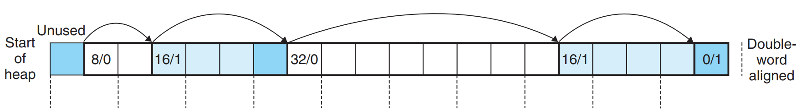

# CSAPP Learning 

---
*This document is specially for MallocLab of book CSAPP.*

## 解法原理 (87/100)



同时结合**分隔空闲列表**的块大小分组方法**简化复杂度**。

注意我们是被禁止**使用全局静态数组**的，所以分组的指针存在堆的最开头位置。

```C
#define HEADER(p) (*(unsigned int *)((char *)(p) + OFFSET))
#define SIZE(p) (HEADER(p) & ~0x1)
#define ISALLOCATED(p) (HEADER(p) & 0x1)
int getSeg(unsigned size);
...
```

注意定义一些 **宏** 和 **辅助函数** 来简化代码。

## 时间复杂度分析
* `malloc()` - **优化过的** $O(n)$
* `free()` - $O(1)$，合并情况**最坏** $O(n)$
* `realloc()` - 参考上述

## 空间优化策略
时间分比较容易拿满，空间利用率比较关键
* `free()` 时检查**前后块能否合并**
* 尾部未分配的时候可以**占用一部分尾部再去扩充堆**
* `realloc` 时**原地的增大/减小空间**
* ...

---
***By Tab_1bit0***