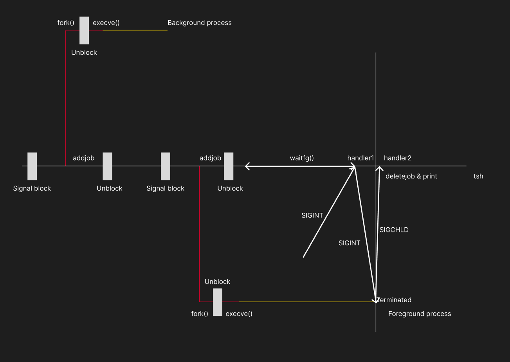

# CSAPP Learning

---

*The document is specially for ShellLab of book CSAPP.*

## 用法补充

### pid & kill() & waitpid()
| 参数 pid 的值 | waitpid 的行为目标 | kill 的行为目标 |
| :---: | :---: | :---: |
| `pid > 0` | 等待 PID 正好等于 pid 的那个特定子进程。 | 把信号发送给 PID 正好等于 pid 的单个进程。 |
| `pid == 0` | 等待与调用者同属一个进程组的任意子进程。 | 把信号发送给与调用者同属一个进程组的所有进程。 |
| `pid == -1` | 等待任意一个子进程。 | 把信号广播给有权限发送的所有进程（极度危险！）。 |
| `pid < -1` | 等待进程组 ID 等于 pid 绝对值 的任意子进程。 | 把信号发送给进程组 ID 等于 pid 绝对值 的所有进程。 |

但是 `waitpid()` 如果**返回了-1**，这意味着**没有任何对应的子进程，或是出现了错误**。
而 `fork()` 如果**返回了0**，这意味着 `fork()` 在子进程中执行。

注意 `kill()` 函数方法是向**特定的 `pid` 发送特定的信号**，不是简单的杀死进程。

`waitpid()` 它针对 stopped 和 terminated 的进程有着**不同的策略**。只是stopped并不会清理干净对应进程的内存。

`waitpid()` 的 `options` 有以下**若干可选参数**（二进制位保存用 | 连接）：
* `0` - 默认处理，即挂起直到目标进程返回。
* `WNOHANG` - 如果没有子进程终止，立即返回 0。
* `WUNTRACED` - 除了终止的，如果子进程停止了也返回。
* `WCONTINUED` - 如果停止的进程收到 SIGCONT 重新开始运行也返回。

而指针变量 `*statusp` 有：
| 宏命令 | 含义 |
| :---: | :---: |
| `WIFEXITED(status)` | 如果子进程正常退出（调用 exit 或返回），则为真。 |
| `WEXITSTATUS(status)` | 在上面为真的情况下，提取具体的退出状态码。 |
| `WIFSIGNALED(status)` | 如果子进程是因为未捕获的信号而终止的，则为真。 |
| `WTERMSIG(status)` | 提取导致进程终止的信号编号（比如被 Ctrl+C 后的 SIGINT）。 |
| `WIFSTOPPED(status)` | 如果子进程当前是停止状态，则为真。 |
| `WSTOPSIG(status)` | 提取导致进程停止的信号编号（比如 Ctrl+Z 后的 SIGTSTP）。 |

有两类，一类是专门返回布尔值的**是不是**，还有一类专门做位运算**取值**，实际操作不要做混淆。

### sigprocmask() 与信号阻塞

```C
sigset_t mask, prev_mask;
sigemptyset(&mask);
sigaddset(&mask, SIGCHLD);

sigprocmask(SIG_BLOCK, &mask, &prev_mask);
sigprocmask(SIG_SETMASK, &prev_mask, NULL);
```

这里我们做的事是**屏蔽SIGCHLD信号**，`sigprocmask()` 的三个参数分别是**操作类型**，**实施策略**，**旧备份存档**。

这个过程的重要工程思想是**状态保存与恢复**，因为在异步编程的环境下**我们没法猜测先前设定了什么状态，加了什么信号阻塞**，尤其是代码长的情况下。

* 为什么要信号**阻塞**？

并发编程中，我们无法控制两个进程**谁先谁后**到达某个位置，也没法控制信号什么时候被捕捉到。

比如刚 `fork()` 完一个进程，这个子进程**运行结束**并发送了 `SIGCHLD` 信号，  
结果主程序连addjob的事情都没有做，就要跳到sigchld_handler去删掉这个进程并deletejob。
然后就会引发一些诡异的事情，包括但不限于**段错误**，**误删**等等。

在下面的原理图当中，没有Block的行为，那么SIGCHLD直指向addjob前面的位置也不无可能。

### C语言字符串操作比较，指针变量操作等（不再赘述）

## 工作原理

异步编程实际上是一个**对时间轴掐关键帧**的过程。



* **waitfg() 有什么用？**

因为我们这里挂着的还是tsh的页面

（图中所有线段都只满足拓扑学意义，并非线性时间轴！）

## 细节问题

### 为什么这里的 signal 感觉是即时触发的，尽管事实上应该是只在Kernel Mode到User Mode的一瞬间发生的？

事实上确实只在Kernel Mode到User Mode的一瞬间发生，但是由于
* CPU一秒几百上千次的**硬件定时器**会强制切换刷新
* 频繁的**系统函数调用**
* CPU多核情况下的**协作**

导致所有信号的接收都是几乎**瞬时**的。

### 我们这里所谓前台进程是不是没被挂出来，而是模拟的tsh不输出东西挂着?

**是的。**
这和真实的Shell有所出入，也正如上面一个图所示，我们在终端里Ctrl+C的时候实际上是把这个   `SIGINT` 发给了 `waitfg()` 中的tsh，**而非前台进程本身**，如上图所示。

换言之，我们也可以发现，当我们在Shell中敲下 `./runner` 的时候，所发生的也远不止 `fork()` + `execve` 那么简单。

如果与真实情况一致，会导致实验难度巨大幅度上升。

---

***By Tab_1bit0***